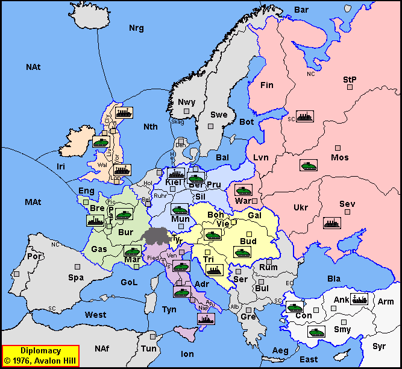

# Dippy "A", Winter 1900

[-> index](index.md)

Ich freue mich das es los geht! 
Ich hatte in der Vergangenheit viel, viel Spaß
mit Diplomacy. Beginnend um die Zeit des Abis
drumrum haben wir in der Aula und in 'der Antwort'
Dippy gespielt.

Ich bin auf eine Seite mit guten [Regeln](http://www.ludomaniac.de/regeln/Standard/Standard.htm) gestoßen.

## Mitspieler

| Nation       | Spieler    |
|--------------|------------|
| **Austria**  | Jens       |
| **England**  | Stefan     |
| **France**   | ChristianP |
| **Germany**  | Andreas    |
| **Italy**    | ChristianZ |
| **Russia**   | Mirko      |
| **Turkey**   | Willow     |

## Startaufstellung

| Austria | England | France  | Germany | Italy   | Russia  | Turkey  |
|---------|---------|---------|---------|---------|---------|---------|
| `A Vie` | `F Edi` | `A Mar` | `A Ber` | `A Ven` | `A Mos` | `A Con` |
| `A Bud` | `A Liv` | `A Par` | `A Mun` | `A Rom` | `A War` | `A Smy` |
| `F Tri` | `F Lon` | `F Bre` | `F Kie` | `F Nap` | `F PeS` | `F Ank` |
|         |         |         |         |         | `F Sev` |         |
{: .orders}

## Zentren

| Austria | England | France | Germany | Italy  | Russia | Turkey |
|---------|---------|--------|---------|--------|--------|--------|
| `Vie`   | `Edi`   | `Mar`  | `Ber`   | `Ven`  | `Mos`  | `Con`  |
| `Bud`   | `Liv`   | `Par`  | `Mun`   | `Rom`  | `War`  | `Smy`  |
| `Tri`   | `Lon`   | `Bre`  | `Kie`   | `Nap`  | `PeS`  | `Ank`  |
|         |         |        |         |        | `Sev`  |        |
{: .orders}

**Freie Zentren:** 
Rum Bul Ser Por Spa Swe Nor Den Hol Bel Tun Gre

Ich mag die Karte nicht so gerne, denn die Groß-Kleinschreibugn gefällt mir nicht.
Ich schreibe Land eigentlich immer `Xyz` und Wasser `XYZ`. Steht eine Flotte an einer
bestimmten Küste, ist es `XyZ`. 

Die Flotte in [Petersburg](https://diplomacy.fandom.com/wiki/Saint_Petersburg) 
steht zu Beginn an der [Südküste](https://faculty.washington.edu/majeski/426/sim1.html): `Pet (sc)` oder `PeS`.

## Nächste Runde

Also ich würde sagen, lasst es uns langsam angehen. Ich brauche je einen Befehl für
eure Einheiten. In den meisten Fällen wahrscheinlich ein Bewegungsbefehl, den ein oder anderen
Support-to-Move könnte es aber wohl geben.

Wenn der letzte angegeben hat, werte ich aus. Als Ziel vielleicht Mitte nächste Woche, spätestens
aber nächsten Freitag, 17 Uhr. In Ordnung?
