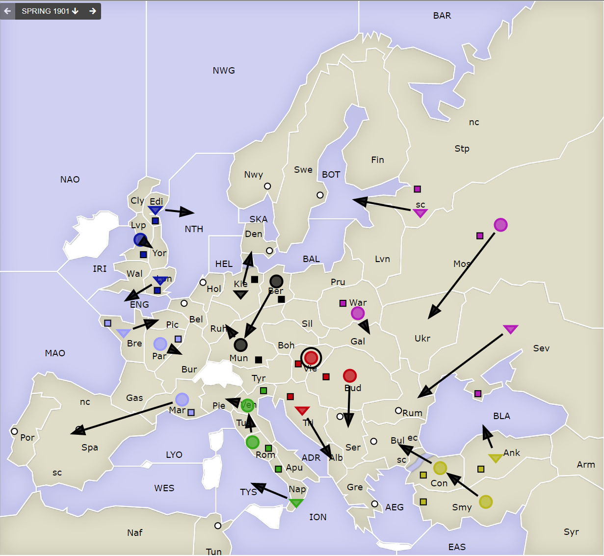
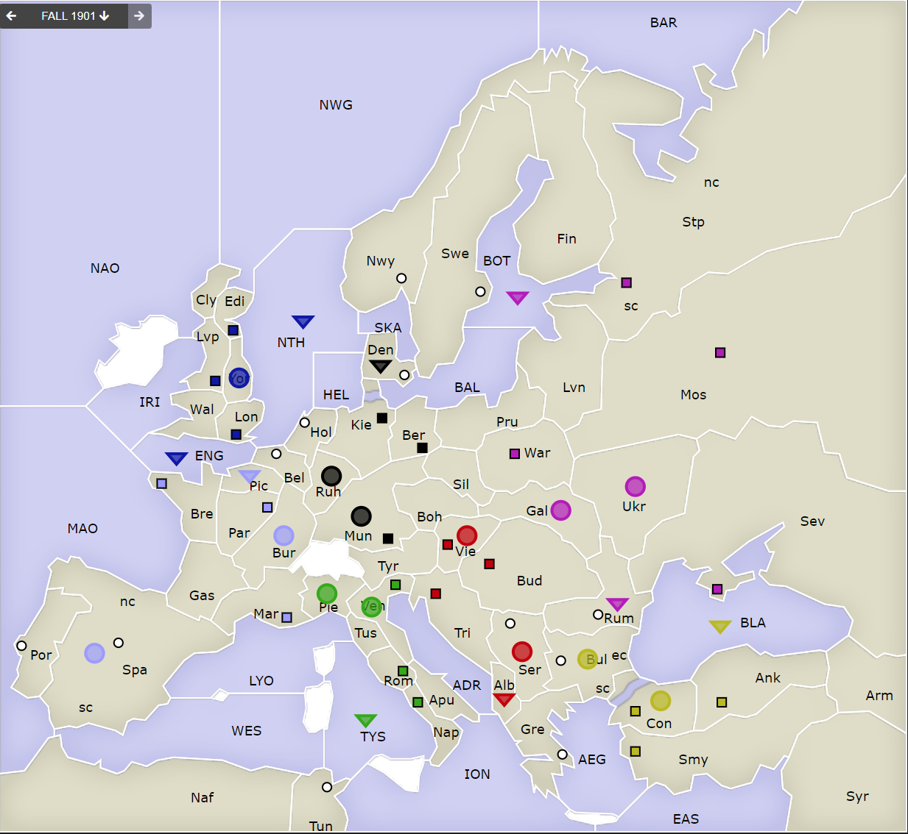

# Dippy "Atari", 1901 Frühjahr

Alle Züge sind gut angekommen.

## Züge

Ich habe ein klein wenig normiert und normalisiert. is alle die Notation richtig raushaben.

| Austria     | England     | France      | Germany      | Italy       | Russia      | Turkey      |
|-------------|-------------|-------------|--------------|-------------|-------------|-------------|
| `F Tri-Alb` | `F Lon-ENG` | `F Bre-Pic` | `F Kie-Den`  | `F Nap-TYS` | `F PeS-BOT` | `A Con-Bul` |
| `A Bud-Ser` | `F Edi-NTH` | `A Mar-Spa` | `A Ber-Mun`  | `A Ven-Pie` | `A War-Gal` | `A Smy-Con` |
| `A Vie hld` | `A Lvp-Yor` | `A Par-Bur` | `A Mun-Ruh`  | `A Rom-Ven` | `A Mos-Ukr` | `F AnK-BLA` |
|             |             |             |              |             | `F Sev-Rum` |             |
{: .table-cols-7}

Alle nicht ausführbaren Züge sind <u>unterstrichen</u>. Ähhh... ja. Es hat also alles geklappt.

Ein paar interessante Bewegungen sind schon dabei. Ich habe ja von euren Verhandlungen nichts mitbekommen.
daher kann ich völlig unparteisch Beobachtungén abgegen :-)

 * Also **Russia** und **Turkey** haben sich im `BLA` entweder gut geeinigt, oder es wird spannend in `Sev`. 
   Sieht ja nicht so aus, als wolle **Turkey** in `Con` für eine Durchfahrt von `BLA` Platz machen. Andererseits, wo hätte `Ank` sonst hinziehen sollen? 
   `Ank-Arm` wäre noch agressiver gewesen.
 * ~~**Englische** Flotte im `ENG`? Dass `Lvp` nicht nach `Lon` nachgezogen ist, sondern zur Sicherheit nach `Yor` lässt
   vermuten, dass ein `Fr F Bre-ENG` vermutet wurde. Oder auch nur zur Sicherheit? Jetzt eine `En A Lon` wäre jedenfalls
   flexibler gewesen.~~ ((Edit: So ein Quatsch, towi: von `Lvp` kommt man nicht nach `Lon`. Danke Stefan.))
 * Ui, **Italienische* `A Pie`! Das beschäftigt vielleicht nun `Fr A Spa`. `FR A Bur` scheint eigene Sorgen zu haben.
 * `Tyr` ist frei, aber umlagert von `Ge`, `Au` und `It`. Eine Pufferzone?
 * **Austria** kann voll nach `Gre`. Aber **russich** `A Gal` steht vor `Bud` _und_ `Vie`. Ist also `A Ser` zu beschäftigt
   um `F Alb-Gre` zu unterstützen? Und selbst wenn, `Tu A Bul` steht stategisch sehr interessant.

## Zentren

| Austria | England | France | Germany | Italy  | Russia | Turkey |
|---------|---------|--------|---------|--------|--------|--------|
| `Vie`   | `Edi`   | `Mar`  | `Ber`   | `Ven`  | `Mos`  | `Con`  |
| `Bud`   | `Liv`   | `Par`  | `Mun`   | `Rom`  | `War`  | `Smy`  |
| `Tri`   | `Lon`   | `Bre`  | `Kie`   | `Nap`  | `PeS`  | `Ank`  |
|         |         |        |         |        | `Sev`  |        |

**Freie Zentren:** 
Rum Bul Ser Por Spa Swe Nor Den Hol Bel Tun Gre

## Nächste Runde

Ich schätze mal, dass es wieder einiges zu verhandeln gibt. Wieder Freitag, 17 Uhr, 24.6.2021?

Die meisten haben via Discord abgegegen. 
Ich habe gemerkt, dass zu viele Eingangskanäle für mich verwirrend sind. 
Also sage ich mal, ich präferiere Discord und Email an torsten.will+dippy BEI gmail PUNKT com (ohne das +dippy Suffix geht auch, das hilft mir nur beim einsortieren).

Ein perfekter Zug, sähe so aus:

    Partie: Dippy Atari
    Runde: 1901 Herbst
    Spieler: Max Mustermann
    Züge:

       A Dip-DOP
       A Dum S Dip-DOP
       F DAP hld

Bis dann!

---

> **Änderungen** auf dieser Seite
>
> Bisschen Chaos mit den Editoren gehabt. Remote Dev mit Idea hat mir wohl mal die Markdown Datei in einen alten Zustand zerschossen. Daher
> war es mit den eingebetteten Grafik ein bisschen ein Hin- und Her. Text in der "Zentren" Sektion habe ich auch anpassen müssen.
>
> Dann gab es eine Korrektur zum Thema `Lon` in der Züge Sektion (mit `~` markiert).

