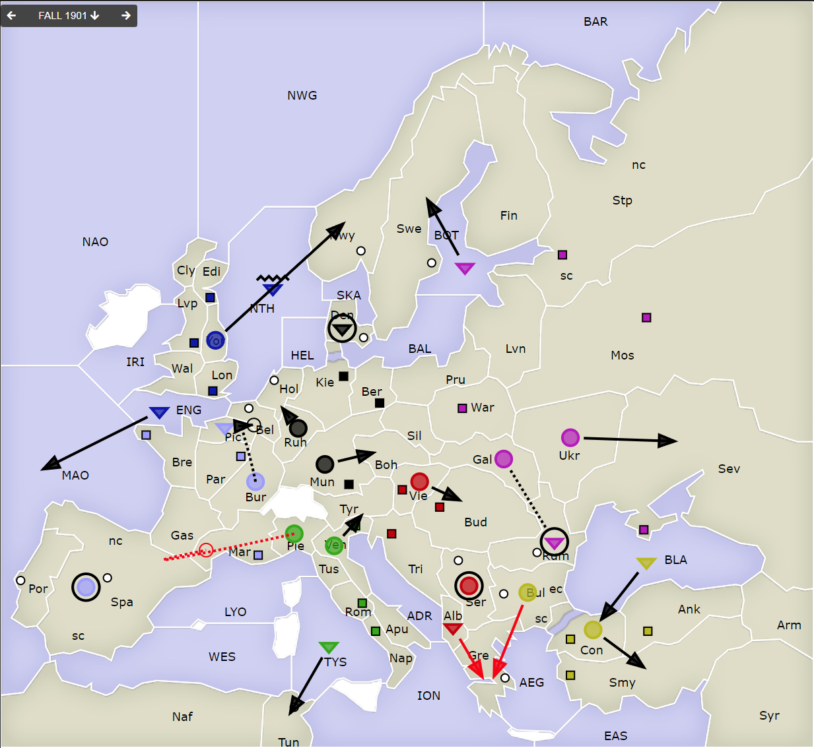
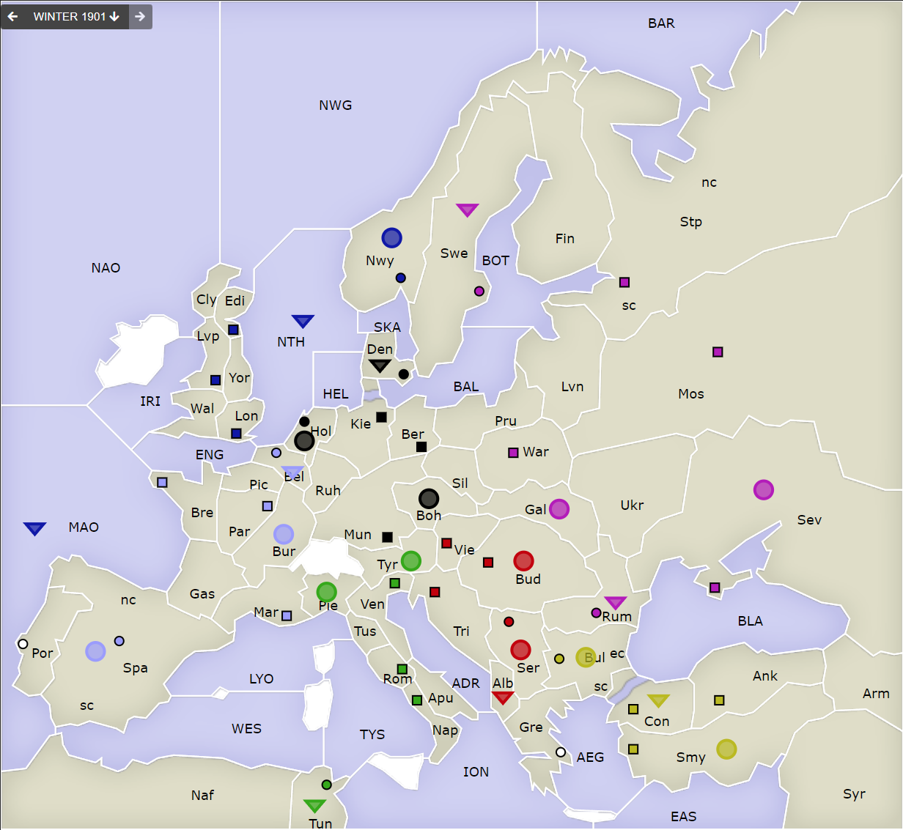

# Dippy "Atari", 1901 Herbst

[-> index](index.md)

Das flutscht ja richtig!

## Züge

| Austria          | England   | France    | Germany   | Italy              | Russia    | Turkey           |
|------------------|-----------|-----------|-----------|--------------------|-----------|------------------|
| <u>F Alb-Gre</u> | F ENG-MAO | F Pic-Bel | F Den hld | <u>A Pie S FrF</u> | F Rum hld | A Con-Smy        |
| A Ser hld        | A Yor-Nwy | A Bur S " | A Ruh-Hol | <u>_ Spa-Mar</u>   | A Gal S " | F BLA-Con        |
| A Vie-Bud        | F NTH C " | A Spa hld | A Mun-Boh | A Ven-Tyr          | A Ukr-Sev | <u>A Bul-Gre</u> |
|                  |           |           |           | F TYS-Tun          | F BOT-Swe |                  |
|                  |           |           |           |                    |           |                  |
{: .orders}

**IMPs** 

(Diese Sektion erklärt "Impossibles" aus der Tabelle, eigentlich der Platz für das Erklären vn Zügen wie "A Mun-Mond" oder so):

* Der Order für `Fr A Pie` war `A Pie S Fr A Spa-Mar` und wurde auf `A Pie S Fr F SpS-Mar` geändert.

> Ich hatte vorher gesagt, dass Einheiten-Typ ("F" oder "A") und Nation in den
> Zügen optional sind; eine "A Spa" gibt es nicht, wohl aber eine "F". Beim Quell-Feld
> und beim Ziel-Feld mit Flotten und Küsten wenn eindeutig ist die exakte Angabe der
> Küste ebenfalls optional ("F Mar-Spa" wird korrigiert zu "F Mar-SpS". Aber
> "F Por-Spa" ist "IMP", weil nicht eindeutig => Haltebefehl).

Alle nicht ausführbaren Züge sind <u>unterstrichen</u>.

**Anmerkungen** -- hoffentlich unparteiisch genug:

* Der Zug von `Fr A Pie` ist lustig. Jau, das sollte ein Spielleiter-Test oder ein Wink
  an den Franzosen sein -- oder ist das ein Hinweis auf eine gebrochene Absprache?
* Das hier ist für alle interessant, denke ich:
  Russland hat `Ru A Rum hld` gespielt. Er hätte auch `Ru A Rum S Ukr-Sev` machen können,
  dann wäre der Zug `Ru A Ukr-Sev` 2 stark gewesen -- für den Fall, dass `Tu F BLA`
  "Ideen" gehabt hätte. **Regel dazu:** Man kann eine Einheit beim Halten unterstützen,
  die einen Support durchführt. Wird letztere angegriffen, dann wird der Support
  in einen Haltebefehl umgewandelt und der Support-to-Hold macht diesen 2 stark.
* Der Österreicher hätte `Au A Ser S F Alb-Gre` machen können und wäre dort mit Stärke 2
  hinein gekommen. Aber ich kenne natürlich die Absprachen nicht.
  Auch hier wäre dann wieder -- falls `Tu A Bul-Ser` -- der Support in einen
  Haltebefehl umgewandelt worden.
* In `Gre` gab es ein Patt zwischen `Au A Alb-Gre` und `Tu A Bul-Gre`. Bemerkenswert.
* Ah, und wir sehen den ersten Convoy! England landet in Norwegen.
* Der Franzos' unterstützt den Zug `Fr F Pic-Bel`. Faszinierend.   
  Ist schon frustrierend, wenn man von den Absprachen _gar_ nix
  mitbekommt :-) -- aber vielleicht war es ja auch nur eine Absicherung.

**Rückzüge und Vertreibungen**

...gab es keine.

Aber mal theoretisch, um die Regeln zu erklären. Sorry Mirko, da muss
mal wieder der Russe herhalten.

Also angenommen es hätte gegeben

 * `Au A Vie-Gal` -- schneidet den Support in `Gal` ab.
 * `Au A Ser-Rum` -- Angriff mit Stärke 2.
 * `Tu A Bul S Au A Ser-Rum`
 * <u>`Ru F Rum hld`</u>  -- wird mit Stärke 2 angegriffen, verteidigt nur mit 1.
 * <u>`Ru A Gal S F Rum hld`</u> -- wurde angegriffen, daher in Haltebefehl umgewandelt.

Das würde nun heißen, `Ru F Rum` würde vertrieben.
Ich hätte Mirko hier dann gefragt, wo er hin will und er hätte sich
`BLA` aussuchen können (wurde ja frei). Er hätte auch freiwillig
`>ex` wählen können, das heißt "auflösen". Passiert aber selten.

Wenn wir das in einem Zug auswerten (ohne Nachfrage), dann
hätte Mirko eine Liste für die Einheit abgeben können. Also
zum Beispiel: `F Rum hld > Bul,BLA,ex`. Diese Felder
werden dann der Reihenfolge nach ausprobiert. Komplizierte
Szenarien gehen auch -- mit Bedingungen -- habe ich aber noch
nie gesehen. Das `ex` meint, freiwilliger Abbau. Eine 
Vertreibung nach `Sev` wird dann nicht probiert.

Hat er keine Rückzüge angegeben oder sind keine der angebenen
Felder möglich (und `ex` nicht explizit gelistet), dann
wird das Rückzugsfeld automatisch ermittelt:

Von der Front aus Sicht des angegriffenen gesehen, wird der Uhr nach
die Nachbarfelder gewählt: 1 Uhr, 11 Uhr, 2 Uhr, 10 Uhr, 3 Uhr, 9 Uhr usw.
Das erste mögliche Feld wird dann genommen.

In `Rum`, das von `Ser` angegriffen wurde ist die Reihenfolge
der Felder `Bud,Bul(ec),Gal,BLA,Ukr,Sev`.

Tatsächlich ist diese Methode oft sehr passend. Erstens sind
oft sowieso nicht so viele Felder zur Auswahl, zweitens bleibt
man der "Front" so nahe es geht.

Soweit klar?

## Zentren und Bilanz

| Austria     | England     | France      | Germany     | Italy       | Russia      | Turkey      |
|-------------|-------------|-------------|-------------|-------------|-------------|-------------|
| Vie Bud Tri | Edi Liv Lon | Mar Par Bre | Ber Mun Kie | Ven Rom Nap | Mos War Pet | Con Smy Ank |
|             |             |             |             |             | Sev         |             |
| +Ser        | +Nwy        | +Spa +Bel   | +Den +Hol   | +Tun        | +Rum +Swe   | +Bul        |
| +1          | +1          | +2          | +2          | +1          | +2          | +1          |
{: .orders}

**Freie Zentren:** 
Por Gre

## Aufbauten und Abbauten

Alle haben Versorgungszentren erobert.
Das heißt, alle Nationen
dürfen Aufbauten abgeben. Ich habe vergessen, ob es eine Regelung
für Standardaufbauten gibt, falls ich keinen Zug bekomme. Daher
mache ich das diesmal so, dass ich warte, bis ich alle habe. 
In der Zukunft muss ich diese Regel dann klären.

Nun also, gebt mir eine schnelle Nachricht, in welchem
**Heimatversorgungszentrum** ihr aufbauen wollt -- und
ob es eine Armee oder Flotte sein soll. St. Petersburg könnte bei
einer Flotte zwischen `StS` und `StN` wählen.

    Partie: Dippy Atari
    Runde: 1901 Winter
    Nation: Switzerland
    Spieler: Max Mustermann
    Züge:

       +F Swi
       +A Swa
       +A Swu
       -A Weg

Hier nehme ich von oben nach unten so viele Aufbauten, wie es
geht. Wäre hier `Swi` erwarteter- oder unerwarteterweise
belegt, dann würde ich den Aufbau `Swa` stattdessen nehmen.

Listet ihr Abbauten und Aufbauten zusammen auf, ist es für mich
eindeutig, dass der Abbau _nur_ ausgeführt werden soll, wenn
ihr unerwarteterweise _zu wenig Zentren_ habt um eure Einheiten
zu unterhalten. Soll eine Einheit _unbedingt_ abgebaut werden,
dann solltet ihr das besser dazu schreiben. Man _darf_ nämlich
freiwillig abbauen (also noch genug Zentren hätte). 
Ob man gleichzeitig ab- und
aufbauen kann, müsste ich noch einmal nachgucken, ich glaube aber ja.

Und nun los!
