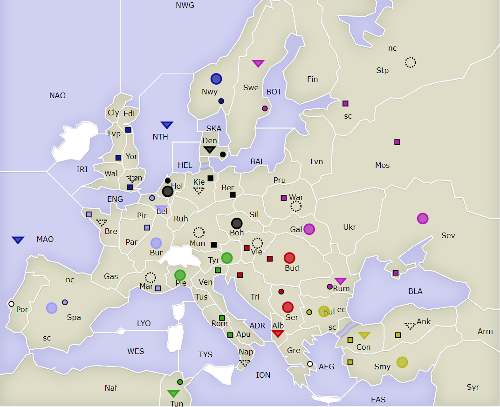
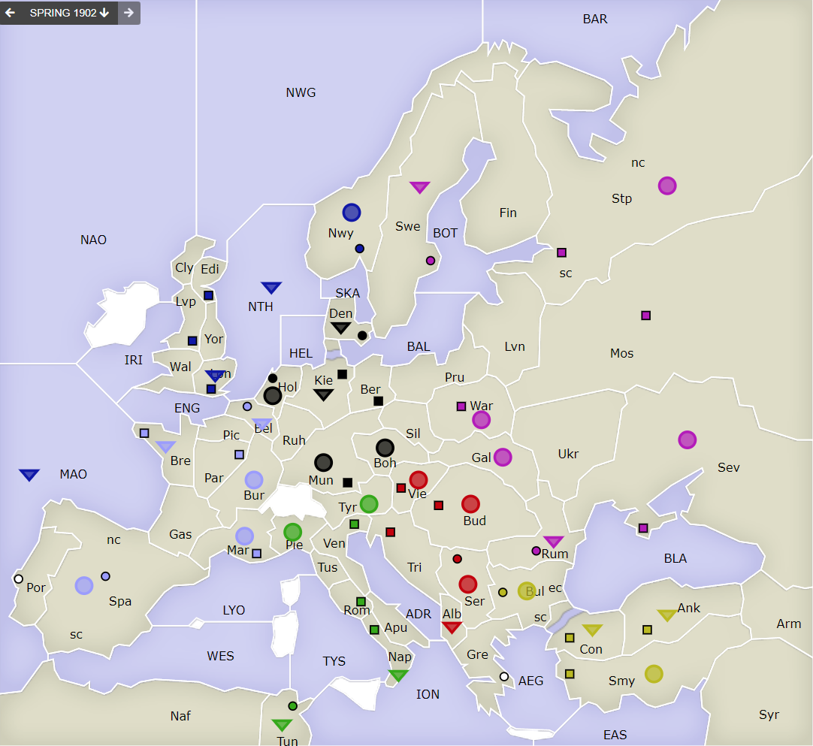

# Dippy "Atari", 1901 Winter

[-> index](index.md)

Alle Aufbauten sind eingetroffen.

## Züge

| Austria     | England   | France    | Germany   | Italy   | Russia    | Turkey    |
|-------------|-----------|-----------|-----------|---------|-----------|-----------|
| +A Vie      | +F Lon    | +A Mar    | +F Kie    | +F Nap  | +A Stp    | +F Ank    |
|             |           | +F Bre    | +A Mun    |         | +A War    |           |
{: .orders}

Was sagt mir das? 

 * `A Vie` ist keine Flotte in Tri, was klar Anti-italienisch gewesen wäre. So kann es alles sein.
 * `F Lon` ist, was man als Engländer aufbaut. Eine `A Lon` wäre klar anti-russisch gewesen, finde ich.
 * `A Mar` ist keine anti-italienische Flotte würde ich sagen. `F Bre` sieht sehr un-englisch aus.
 * `F Nap`? Kann nur im Süden gegen Fr, Au oder Tu agieren. Oder ist das schon gegen En? Interessant.
 * Russland keine `F Sev` ist türken-freundlich. `War` ist nah an Deutschland. A `Stp` ist nicht so gegen England, wie es eine `F StN` gewesen wäre.
 * Eine `F` in `Ank`? Sieht irgendwie un-russisch aus. Andererseits, eine Armee kommt ja nicht leicht durch Konstantinopel. Kann ich also nichts draus ablesen.

Das ergibt dann:

## Frühjahrszüge erwartet

Nun geht es darum, **im Herbst** in neuen Versorgungszentren zu
stehen. Wo ihr nach diesem Frühjahrszug steht, ist egal. 
Zentren wechseln nur im Winter die Besitzer*in.

Ihr könnt Zentren (logischerweise?) auch ruhig verlassen. Sie 
gehören so lange euch, bis kein anderer im Winter
drinsteht.

Hier ein Musterzug:

    Partie: Dippy Atari
    Runde: 1902 Frühjahr
    Nation: Switzerland
    Spieler: Max Mustermann
    Züge:

       F Swi-SWA  > Swu,Swo
       F SWX S "
       A Swu hld

Machen wir mal wieder Freitag 17 Uhr? Aber Soft-Termin? Weil Stefan ist ja
unterwegs. Ich bin auch in Österreich, aber eine Mini-Auswertung mit
Karten sollte ich mindestens hinbekommen.

Warten wir mal, was Stefan sagt. Ich halte euch im Discord auf dme Laufenden.
