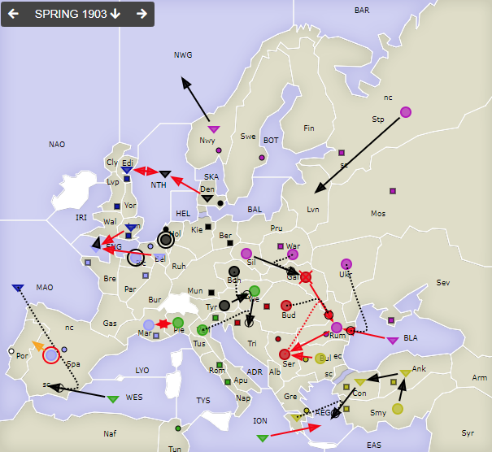
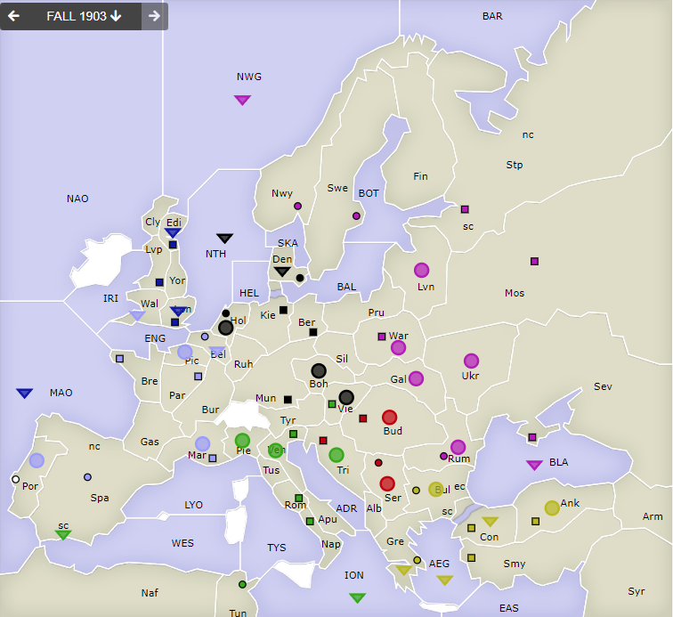

# Dippy "Atari", 1903 Frühjahr

**Navigation**: [index](index.md) // [<- 1902 Ganzes Jahr](dippy-a1902.md) // 1903 Frühjahr //  [-> 1903 Herbst/Winter](dippy-a1903h.md) 

---

So, ich bin aus Österreich zurück. Ich habe keine Spur von Truppen gesehen, nur
Schützengräben aus WWI...

## Züge

| Austria          | England          | France            | Germany          | Italy            | Russia           | Turkey           |
|------------------|------------------|-------------------|------------------|------------------|------------------|------------------|
| <u>A Gal-Rum</u> | <u>F Edi-NTH</u> | <u>F Bel-ENG</u>  | A Tyr-Vie        | <u>F ION-AEG</u> | <u>F BLA-Rum</u> |        F Ank-Con |
| &nbsp; &gt; ex   | <u>A Lon-ENG</u> | F ENG-Wal         | A Boh S "        | <u>A Pie-Mar</u> | A Ukr S "        | <u>A Bul-Ser</u> |
| A Bud S "        | F MAO S ItF      | <u>A Mar-Pie</u>  | <u>F Den-NTH</u> | A Vie-Tri        | F Nwy-NWG        |        F Con-AEG |
| <u>A Ser S "</u> | &nbsp; WES-SpS   | *A Pic*           | A Hol hld        | A Ven S "        | <u>A Rum-Ser</u> |        F Gre S " |
|                  |                  | <u>A Spa hld</u>  | <u>F NTH-Edi</u> | F WES-SpS        | A Sil-Gal        |        A Smy-Ank |
|                  |                  | &nbsp; *&gt; Por* |                  |                  | A War S "        |                  |
|                  |                  |                   |                  |                  | A Stp-Lvn        |                  |
{: .orders}

Anmerkungen: 

* Alle nicht ausführbaren Züge sind <u>unterstrichen</u>, die *kursiven* erhielten keinen Befehl. 
* Frankreich hat für `Fr A Pic` keinen Befehl abgegeben, das heißt, sie hielt.
* `Au A Gal-Rum` war nicht erfolgreich, denn der Support aus `Ser` wurde unterbrochen. Statt
  dessen wurde sie vertrieben. Und in Ermangelung eines freien Rückzugfeldes
  wurde sie *aufgelöst* -- mit `> ex` markiert. Zwar war dafür kein Befehl angegeben, aber weil's die
  einzige Möglichkeit war, ist es nicht kursiv.
* Die `Fr A Spa` wurde vertrieben und das Rückzugsfeld automatisch ermittelt. Die Reihenfolge
  war: (`MAO`), (`LYO`), `Por`, (`Mar`), `Gas`.
* Es war zwar `It F WES-Spa` angegeben (sowohl bei der Bewegung, als auch dem Support),
  aber da `SpS` hier eindeutig ist, korrigiert sich das automatisch.
  * Ich bin mir nicht sicher, ob das Dippy-Standard ist, aber es ist mindestens unsere Hausregel.
  * Ich empfehle aber jedem,
    sich für Flotten anzugewöhnen, _immer_ die Küste mit anzugeben, wenn nötig. Denn wenn
    es `F Por-Spa` gewesen wäre, dann wäre das `IMP` -- "impossible" und somit ein unmöglicher
    Bewegungsbefehl (nicht mal im Halten unterstützbar). Sowas markiert man mit `§`, aber das sieht man selten.
    Es hätte dann so ausgesehen: <u>`F Por-Spa§`</u>.

## Zentren

| Austria     | England     | France      | Germany     | Italy       | Russia      | Turkey      |
|-------------|-------------|-------------|-------------|-------------|-------------|-------------|
| Bud Tri Ser | Edi Liv Lon | Mar Par Bre | Ber Mun Kie | Ven Rom Nap | Mos War Pet | Con Smy Ank |
|             |             | Spa Bel     | Den Hol     | Vie Tun     | Sev Rum Nwy | Bul Gre     |
|             |             |             |             |             | Swe         |             |
{: .orders}

**Freie Zentren:** 
Por

## Nächste Runde

Schafft ihr es bis Freitag, 17 Uhr, 22.7.2021? Wenn nein, sagt bis Dienstag (oder so) Bescheid, dann ändern wir das.

Ich hätte gerne:

 * **Befehle an die Einheiten**
 * **Potenzielle Rückzüge** (Bedingungen an Züge anderer sind möglich) -- fehlt dies, ist das meist nicht schlimm.
 * **Winterauf- und Abbauten** (auch hier sind Bedingungen an die neue Situation möglich) -- fehlt dies, frage ich diesmal persönlich nach. 
 

Zum Beispiel so:

    Partie: Dippy Atari
    Runde: 1903 Herbst/Winter
    Nation: Switzerland
    Spieler: Max Mustermann
    Befehle:

       A Dip-DOP       > Din,Dum
       A Dum S Dip-DOP
       F DAP hld       > DUK

       + A Dag, + F Duv
       - F DAP 

Bis dann!
