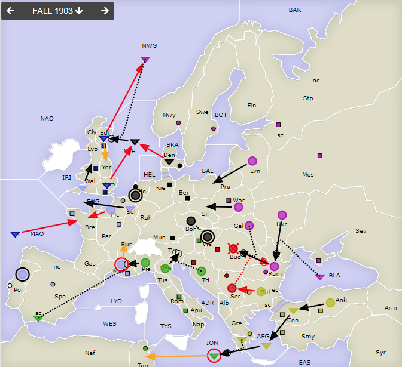
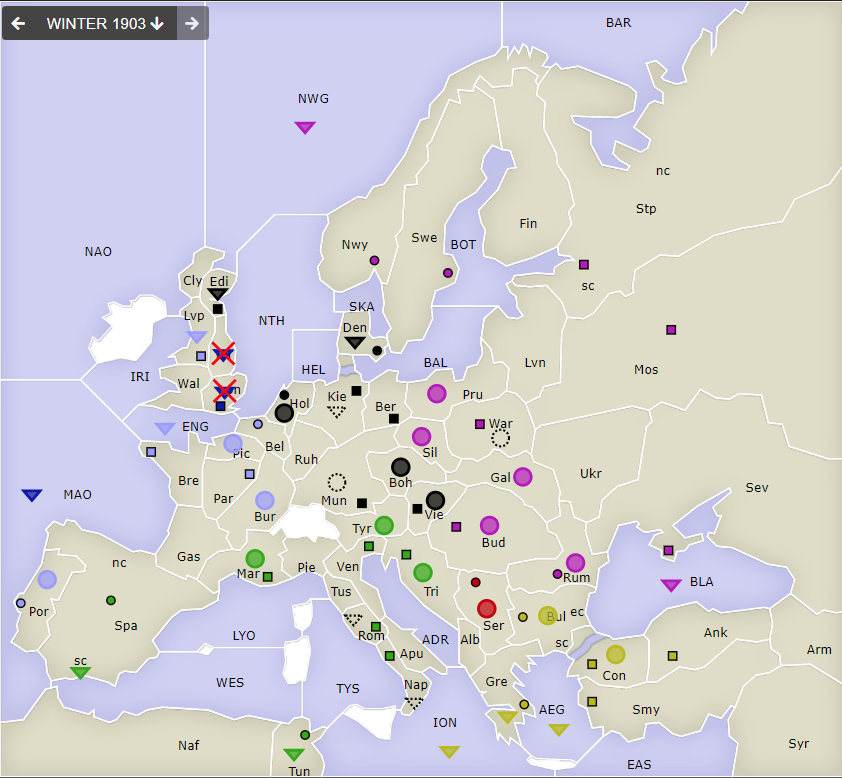
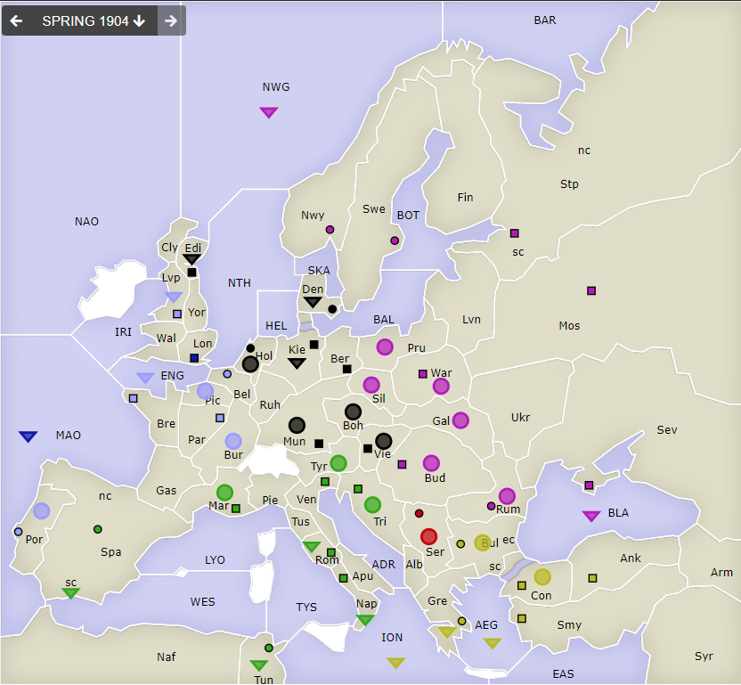

# Dippy "Atari", 1903 Herbst+Winter

**Navigation**: [index](index.md) // [<- 1903 Frühjahr](dippy-a1903f.md) // 1903 Herbst/Winter //  [-> 1904 Frühjahr](dippy-a1904f.md) 

---

Ab jetzt also im Sonntagsrhythmus.

## Züge

| Austria          | England          | France            | Germany          | Italy            | Russia           | Turkey           |
|------------------|------------------|-------------------|------------------|------------------|------------------|------------------|
| <u>A Bud-Rum</u> | <u>F Edi-NWG</u> | F Bel-ENG         | A Vie hld        | <u>F ION hld</u> | A Ukr-Rum        | A Ank-Con        |
| &nbsp; > ex      | &nbsp; > Yor§    | <u>A Mar hld</u>  | A Boh S "        | &nbsp; > Tun     | F BLA S "        | <u>A Bul-Ser</u> |
| <u>A Ser S "</u> | <u>F Lon-NTH</u> | &nbsp; > Bur§     | <u>F Den-NTH</u> | A Pie-Mar        | A Rum-Bud        | F Con-AEG        |
|                  | <u>F MAO-Bre</u> | <u>A Pic-Bre</u>  | A Hol hld        | F SpS S "        | A Gal S "        | F AEG-ION        |
|                  |                  | A Por hld         | F NTH-Edi        | A Ven-Tyr        | A Lvn-Pru        | F Gre S "        |
|                  |                  | F Wal-Lvp         |                  | A Tri S "        | F NWG SGeF       |                  |
|                  |                  |                   |                  |                  | &nbsp; NTH-Edi   |                  |
{: .orders}

Anmerkungen: 

* `§`: No orders/retreat received.

Gedanken:
 * France hat sich dazu entschieden, nicht nach `Fr Por SpS/SpN` zu ziehen, was den
   italienischen Support unterbrochen hätte. Klar, wusste er nicht, was der Brite macht -- und mit dem steht er ja nicht gut.
   Vielleicht wäre ein potenzieller Verlust `Por` strategisch unschön gewesen. 
   Jedenfalls konnte der Italiener so also nach `Mar`.
 * Whow, viele 1 starke Züge um die britische Insel herum. Alle Bewegungszüge ohne Supports
   und sehr viele dadurch nicht erfolgreich. Bis auf einen: Der Russe unterstützt den
   Deutschen nach `Edi`. Bemerkenswert.
 * Oi, dadurch ist England in großer Bedrängnis. In der 3fach-Zange, das ist aber auch hart: `Ru`, `Ge`, `Fr`.
 * Achje, dem Österreicher gehts nicht gut. Auch hier eine 3fach-Zange: `Ru`, `Tu`, `It`.
 * Ich bekomme ja nix mit, aber in `Tyr` und `Vie`... die Supports... sieht das so
   aus als könnten Italien und Deutschland nicht gut miteinander?

## Zentren

| Austria     | England     | France      | Germany     | Italy       | Russia      | Turkey      |
|-------------|-------------|-------------|-------------|-------------|-------------|-------------|
| -Bud -Tri   | -Edi -Liv   |-Mar -Spa    |             |             |             |             |
|  Ser        | Lon         | Par Bre Bel | Ber Mun Kie | Ven Rom Nap | Mos War Pet | Con Smy Ank |
|             |             | +Por +Lvp   | Den Hol +Vie| Vie Tun +Mar| Sev Rum Nwy | Bul Gre     |
|             |             |             | +Edi        | +Spa        | Swe +Bud    |             |
{: .orders}

**Freie Zentren:** 
/

## Winterkorrekturen

| Austria     | England | France      | Germany     | Italy  | Russia      | Turkey      |
|-------------|---------|-------------|-------------|--------|-------------|-------------|
|             | -F Lon  |             | +A Mun      | +F Nap | +A War      |             |
|             | -F Yor  |             | +F Kie      | +F Rom |             |             |
|             |         |             |             |        |             |             |
{: .orders}

> Diese Aufbauten sind jetzt final.

## Nächste Runde

Die Frühjahrszüge (evtl. mit Rückzügen) hätte ich gerne bis Sonntag 17 Uhr.

Soll das verschoben werden, sagt einfach Bescheid -- das geht sicher.
Außer es legt jemand gegen die Verschiebung Veto ein, dann wirds demokratisch.
Sobald ich nach dem Termin ("ZAT" = Zugabgabetermin) mit der Auswertung
beginne aber keine Züge vorliegen, halten jene Einheiten ("NOR", No orders received).

Ich hätte gerne:

 * **Befehle an die Einheiten**
 * **Potenzielle Rückzüge** (Bedingungen an Züge anderer sind möglich) -- fehlt dies, ist das meist nicht schlimm.

<!--
 * **Winterauf- und Abbauten** (auch hier sind Bedingungen an die neue Situation möglich) -- fehlt dies, frage ich diesmal persönlich nach. 
-->

Zum Beispiel so:

    Partie: Dippy Atari
    Runde: 1904 Frühjahr
    Nation: Switzerland
    Spieler: Max Mustermann
    Befehle:

       A Dip-DOP       > Din,Dum
       A Dum S Dip-DOP
       F DAP hld       > DUK

Bis dann!
