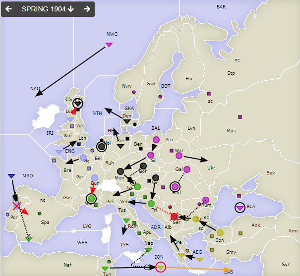
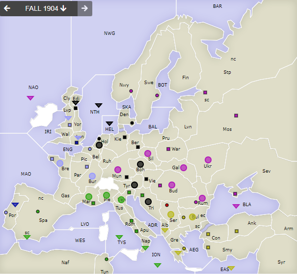

# Dippy "Atari", 1904 Frühjahr

**Navigation**: [index](index.md) // [<- 1903 Herbst](dippy-a1903h.md) // 1904 Frühjahr //  [-> 1904 Herbst/Winter](dippy-a1904h.md) 

---

## Züge

Austria

| Austria          | England          | France            | Germany          | Italy            | Russia           | Turkey           |
|------------------|------------------|-------------------|------------------|------------------|------------------|------------------|
| <u>A Ser SItA</u>| F MAO-Por        | <u>A Bur-Mar</u>  | A Mun-Tyr        | A Mar hld        | F BLA hld        | F AEG-Gre        |
| &nbsp; <u>Tri hld</u>|              | F ENG-Lon         | A Boh S "        | F Tun-ION        | A Bud hld        | A Bul-Ser        |
| &nbsp; &gt; ex   |                  | <u>F Lvp-Edi</u>! | F Den-NTH        | F Nap S "        | A Gal S "        | A Con-Bul        |
|                  |                  | A Pic-Bre         | F Edi hld        | F Rom-TYS        | F NWG-NAO        | F Gre-Alb        |
|                  |                  | <u>A Por-Spa</u>  | A Hol hld        | A Tri-Ven        | A Pru-Sil        | <u>F ION hld</u> |
|                  |                  | &nbsp; &gt; ex    | F Kie-HEL        | A Tyr-Pie        | A Sil-Mun        | &nbsp; &gt; EAS §|
|                  |                  |                   | A Vie-Tri        | F SpS SEnF       | A War-Ukr        |                  |
|                  |                  |                   |                  | &nbsp; MAO-Por   | A Rum STuA       |                  |
|                  |                  |                   |                  |                  | &nbsp; Bul-Ser   |                  |
{: .orders}

Anmerkungen: 

* Frankreich wollte von <u>`F Lvp-Edi`</u>, was aber nicht geht mit einem Schiff. Daher das `!`.
  Hätte aber auch so nicht geklappt, wegen gehalten. 
* Austria ist raus. England wurde nach Portugal unterstützt... brauchte den Russen gar nicht.
* Turkey hat die mühsam erkämpfte `ION` wieder abgegeben. Der Rückzug wurde berechnet. Ansonsten bringen sich um `ION` eine Menge Flotten in Stellung. 

## Zentren

| Austria     | England     | France      | Germany     | Italy       | Russia      | Turkey      |
|-------------|-------------|-------------|-------------|-------------|-------------|-------------|
|             |             |             |             |             |             |             |
|  Ser        | Lon         | Par Bre Bel | Ber Mun Kie | Ven Rom Nap | Mos War Pet | Con Smy Ank |
|             |             |  Por  Lvp   | Den Hol  Vie| Vie Tun  Mar| Sev Rum Nwy | Bul Gre     |
|             |             |             |  Edi        |  Spa        | Swe  Bud    |             |
{: .orders}

**Freie Zentren:** 
/

## Nächste Runde

Bis nächsten Sonntag 17 Uhr hätte ich gerne:

 * **Befehle an die Einheiten**
 * **Potenzielle Rückzüge** (Bedingungen an Züge anderer sind möglich) -- fehlt dies, ist das meist nicht schlimm.
 * **Winterauf- und Abbauten** (auch hier sind Bedingungen an die neue Situation möglich) -- bitte nicht vergessen! 
 

Zum Beispiel so:

    Partie: Dippy Atari
    Runde: 1904 Herbst/Winter
    Nation: Switzerland
    Spieler: Max Mustermann
    Befehle:

       A Dip-DOP       > Din,Dum
       A Dum S Dip-DOP
       F DAP hld       > DUK

       + A Dag, + F Duv
       - F DAP 

Bis dann!
