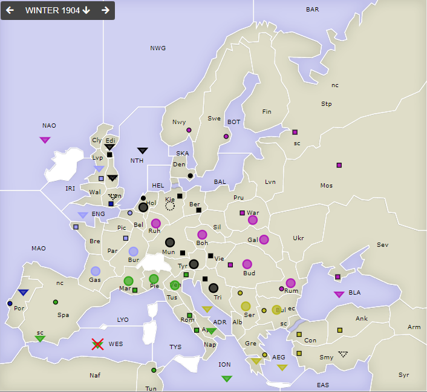

# Dippy "Atari", 1904 Herbst+Winter

**Navigation**: [index](index.md) // [<- 1904 Frühjahr](dippy-a1904f.md) // 1904 Herbst/Winter //  [-> 1905 Frühjahr](dippy-a1905f.md) 

---

Sorry, dass es bei mir etwas später wurde. Was'n komischer Sonntag, was'n komischer Montag.

## Züge

| Austria          | England          | France            | Germany          | Italy            | Russia           | Turkey           |
|------------------|------------------|-------------------|------------------|------------------|------------------|------------------|
| /                | <u>F Por-MAO</u> | A Bre-Gas         | A Boh-Mun        | F ION hld        | F BLA hld        | F Alb-ADR        |
|                  |                  | A Bur hld         | F Edi hld        | A Mar hld        | A Bud hld        | A Bul hld        |
|                  |                  | F Lon-ENG         | F HEL-NTH        | F Nap-Apu        | A Gal hld        | F EAS-AEG        |
|                  |                  | F Lvp hld         | <u>A Hol hld</u>‡| A Ven hld        | A Mun-Ruh        | F Gre hld        |
|                  |                  |                   | A Hol SRuA       | A Pie S "        | <u>F NAO-MAO</u> | A Ser hld        |
|                  |                  |              | &nbsp; <u>Mun-Ruh</u>‡|<u>F SpS-Por</u>  | A Rum hld        |                  |
|                  |                  |                   | F NTH-Yor        | F TYS-WES        | A Sil-Boh        |                  |
|                  |                  |                   | <u>A Tyr-Ven</u> |                  | A Ukr-War        |                  |
|                  |                  |                   | A Tri S "        |                  |                  |                  |
|                  |                  |                   |                  |                  |                  |                  |
{: .orders}

Anmerkungen: 

* `‡`: Multiple conflicting orders ⇒ changed to hold order 

### Gedanken

Hoppla! Die `Ge A Hol` wusste nicht, ob sie halten oder den Russen supporten sollte. Das hat sie so verwirrt,
dass sie dann nur noch halten konnte. 

---

An mehreren Stellen haben sie Spieler gewählt, zwei benachbarte Haltebefehle zu geben, anstatt sich
gegenseitig im Halten zu unterstützen. Turkey in Ser/Bul, Russia in Bud/Rum. Zur Info: Wenn man sich
zwei Einheiten gegenseitig beim Halten unterstützen, dann führt die Regel "Eine Supportbefehl wird
bei einem Angriff in einen Haltebefehl umgewandelt" dazu, dass egal wie man angegriffen wird,
immer mit Stärke 2 verteidigt.

Beispiel: 

 * Tu A Ser S A Bul hld
 * Tu A Bul S A Ser hld

Greift der Russe (nur um ein beliebiges Beispiel zu nennen...) dann an:

 * <u>Ru A Bud-Ser</u>
 * Ru A Rum S Bud-Ser,

dann werden die türkischen Befehle zu

 * <u>Tu A Ser S A Bul hld</u>  // <- also in Haltebefehl umgewandelt
 * Tu A Bul S A Ser hld  // macht die Verteidigung Tu A Ser hld 2 stark.

Ich meine: wirklich keine Kritik! Durchaus eine gültige Taktik, freiwillig nicht 
stark zu verteidigen, um sich gegen alle Eventualitäten abzusichern. Zeigt halt Vertrauen!

---

Der Engländer... lebt! Besser denn je! Niemand in `Lon`, `Por` konnte nicht verlassen werden. Aufbau!

---

Italien hatte als Abbau `-F TYS` angegeben. Eigentlich existierte dort im Winter keine Flotte
mehr. Aber da das offensichtlich die nach `WES` gezogene Flotte gemeint hatte, habe ich
stattdessen die abgebaut. 

Hätte aber zum Zeitpunkt der Winterkorrekturen dort eine andere Flotte jetzt gestanden, dann hätte ich
definitiv die genommen!

Ansonsten hätte ich würfeln müssen: Für jede Einheit hätte ich die Entfernung zum nächsten HVZ gezählt
und die am weitesten stehende Einheit genommen, Flotten vor Armeen. Okay, und dabei wäre `F SpS`
herausgekommen.

Ich denke aber mal, es war hier eindeutig genug, was gemeint war. Aber, Leute, um es mir leicht zu machen,
solltet ihr auf solche Situationen vorbereitet sein. 

---

Und auch der Franzos' hätte gut `A Bur S A Bre-Gas` machen können, nur für den Fall, `It A Mar-Gas` -- aber
vielleicht ja auch kalkuliert, kann schon sein.

Der Deutsche dann wiederum oben in `Edi`: Warum nicht `Ge F Edi S F NTH-Yor`? Nur um gegen ein eventuelles,
wenn auch unwahrscheinliches `Fr F Lon-NTH` zu schützen? Ja, auch das kann Taktik sein, sehe ich ein.

## Zentren

| Austria     | England     | France      | Germany     | Italy       | Russia      | Turkey      |
|-------------|-------------|-------------|-------------|-------------|-------------|-------------|
| /           |             | -Por        |             |-Vie         |             |             |
|             | Lon +Por    | Par Bre Bel | Ber Mun Kie | Ven Rom Nap | Mos War Pet | Con Smy Ank |
|             |             | Lvp         | Den Hol Vie | Tun Mar Spa | Sev Rum Nwy | Bul Gre     |
|             |             |             | Edi +Tri    |             | Swe Bud     | +Ser        |
|             |             |             |             |             |             |             |
{: .orders}

**Freie Zentren:** 
/

## Winterkorrekturen

| Austria     | England | France      | Germany     | Italy  | Russia      | Turkey      |
|-------------|---------|-------------|-------------|--------|-------------|-------------|
| /           | +F Lon  |             | +A Kie      | +F WES |             | +F Smy      |
|             |         |             |             |        |             |             |
|             |         |             |             |        |             |             |
{: .orders}

## Nächste Runde

Die Frühjahrszüge (evtl. mit Rückzügen) hätte ich gerne bis Sonntag 17 Uhr.

Soll das verschoben werden, sagt einfach Bescheid -- das geht sicher.
Außer es legt jemand gegen die Verschiebung Veto ein, dann wirds demokratisch.
Sobald ich nach dem Termin ("ZAT" = Zugabgabetermin) mit der Auswertung
beginne aber keine Züge vorliegen, halten jene Einheiten ("NOR", No orders received).

Ich hätte gerne:

 * **Befehle an die Einheiten**
 * **Potenzielle Rückzüge** (Bedingungen an Züge anderer sind möglich) -- fehlt dies, ist das meist nicht schlimm.

<!--
 * **Winterauf- und Abbauten** (auch hier sind Bedingungen an die neue Situation möglich) -- fehlt dies, frage ich diesmal persönlich nach. 
-->

Zum Beispiel so:

    Partie: Dippy Atari
    Runde: 1905 Frühjahr
    Nation: Switzerland
    Spieler: Max Mustermann
    Befehle:

       A Dip-DOP       > Din,Dum
       A Dum S Dip-DOP
       F DAP hld       > DUK

Bis dann!
