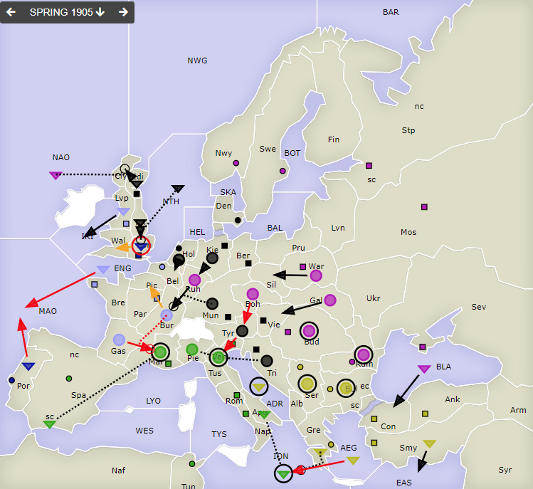
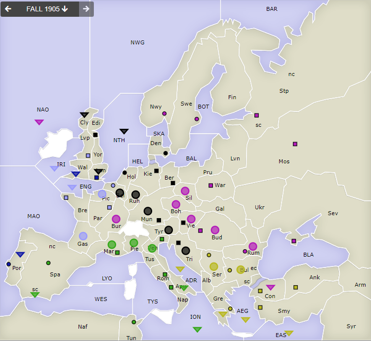

# Dippy "Atari", 1905 Frühjahr

**Navigation**: [index](index.md) // [<- 1904 Herbst](dippy-a1904h.md) // 1905 Frühjahr //  [-> 1905 Herbst/Winter](dippy-a1905h.md) 

---

## Züge

| Austria          | England          | France            | Germany          | Italy            | Russia           | Turkey           |
|------------------|------------------|-------------------|------------------|------------------|------------------|------------------|
| /                | <u>F Lon hld</u> | <u>A Gas-Mar</u>  | F Edi-Cly        | F ION hld        | F BLA-Con        | F ADR hld        |
|                  | &nbsp; &gt; Wal  | <u>A Bur S "</u>  | A Hol-Bel        | F Apu S "        | <u>A Boh-Tyr<u>  | <u>F AEG-ION<u>  |
|                  | <u>F Por-MAO</u> | &nbsp; &gt; Pic § | A Kie-Ruh        | A Mar hld        | A Bud hld        | F Gre S "        |
|                  |                  | <u>F ENG-MAO</u>  | A Mun SRuA       | F SpS S "        | A Gal-Vie        | A Bul hld        |
|                  |                  | F Lvp-IRI         | &nbsp; Ruh-Bur   | A Ven hld        | F NAO SGeF       | A Ser hld        |
|                  |                  |                   | A Tri S Ven      | A Pie S "        | &nbsp; Edi-Cly   | F Smy-EAS        |
|                  |                  |                   | <u>A Tyr-Ven</u> |                  | A Ruh-Bur        |                  |
|                  |                  |                   | F Yor-Lon        |                  | A Rum hld        |                  |
|                  |                  |                   |                  |                  | A War-Sil        |                  |
{: .orders}

Anmerkungen: 
 - § = No retreats received

Gedanken:
 * Turkey und Russland haben wieder als Vertrauensbeweis lieber wieder je zwei getrennte Haltebefehle gemacht, als sich gegenseitig beim Halten zu unterstützen. Strange.
 * `Ru F BLA-Con`. 'nough said.
 * Turkey hätte auch statt `Tu F ADR hld` einen weiteren Support nach `ION` rein machen können. Für mich ist da kein Nachteil ersichtlich. Dann wäre der Angriff 3 stark und erfolgreich gewesen.
 * Russland und Deutschland vereinigt gegen Frankreich in `Bur` und `Cly` -- den Zwischenstopps zu französischen Zentren.
 * Italien macht nur Haltezüge -- und hat unter Beschuss damit Erfolg.
 * Der Deutsche ist nicht nach `Ven` gekommen -- und die türkische Flotte steht in der `ADR` und gähnt -- sind Deutschland und Turkey nun verbündet oder nicht?
   Na, jedenfalls nicht koordiniert. 
 

## Zentren

| Austria     | England     | France      | Germany     | Italy       | Russia      | Turkey      |
|-------------|-------------|-------------|-------------|-------------|-------------|-------------|
| /           |             |             |             |             |             |             |
|             | Lon  Por    | Par Bre Bel | Ber Mun Kie | Ven Rom Nap | Mos War Pet | Con Smy Ank |
|             |             | Lvp         | Den Hol Vie | Tun Mar Spa | Sev Rum Nwy | Bul Gre     |
|             |             |             | Edi  Tri    |             | Swe Bud     |  Ser        |
{: .orders}

**Freie Zentren:** 
/

## Nächste Runde

Bis nächsten Sonntag 17 Uhr hätte ich gerne:

 * **Befehle an die Einheiten**
 * **Potenzielle Rückzüge** (Bedingungen an Züge anderer sind möglich) -- fehlt dies, ist das meist nicht schlimm.
 * **Winterauf- und Abbauten** (auch hier sind Bedingungen an die neue Situation möglich) -- bitte nicht vergessen! 
 

Zum Beispiel so:

    Partie: Dippy Atari
    Runde: 1905 Herbst/Winter
    Nation: Switzerland
    Spieler: Max Mustermann
    Befehle:

       A Dip-DOP       > Din,Dum
       A Dum S Dip-DOP
       F DAP hld       > DUK

       + A Dag, + F Duv
       - F DAP 

Bis dann!
