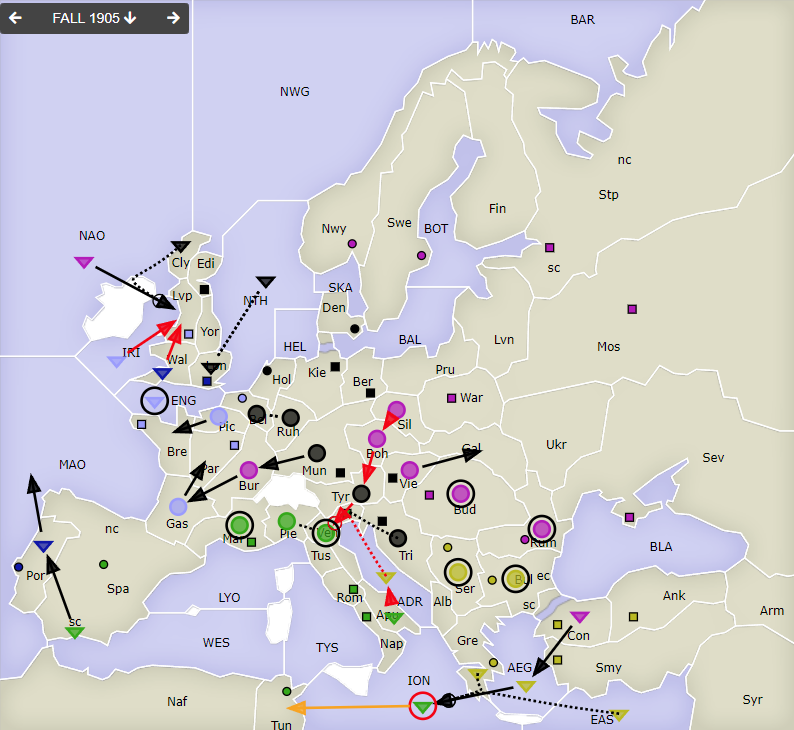
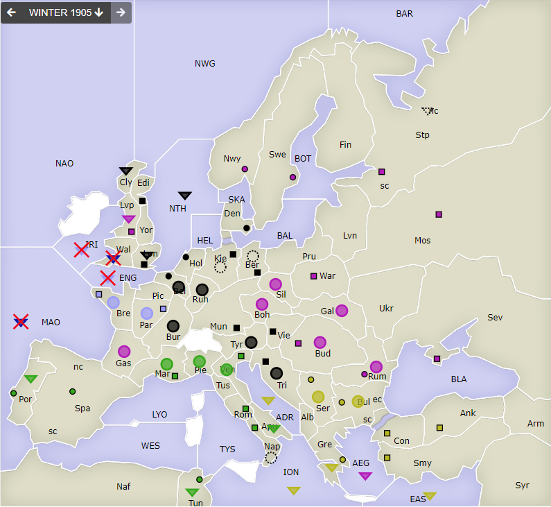
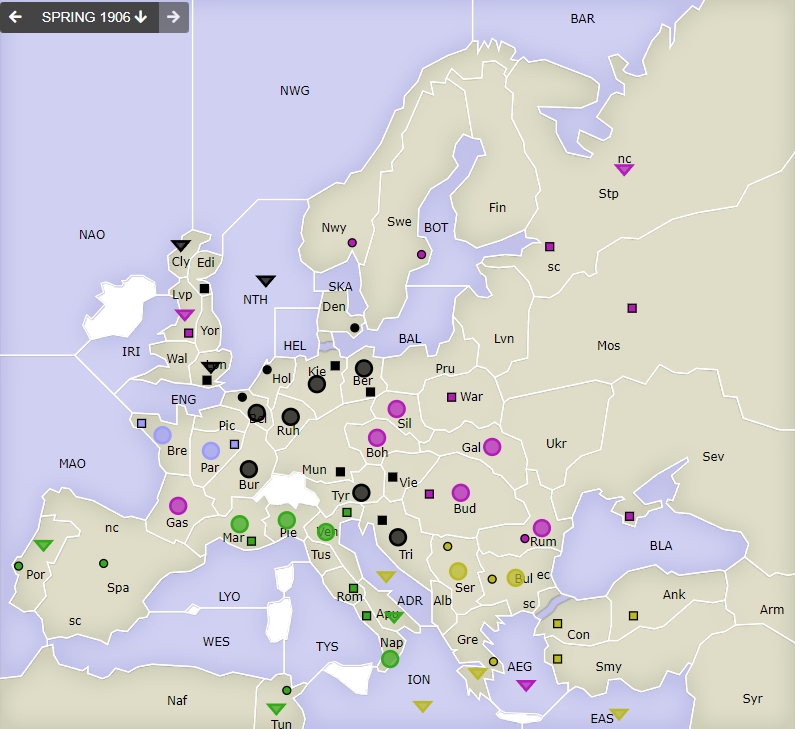

# Dippy "Atari", 1905 Herbst+Winter

**Navigation**: [index](index.md) // [<- 1905 Frühjahr](dippy-a1905f.md) // 1905 Herbst/Winter //  [-> 1906 Frühjahr](dippy-a1906f.md) 

---

Sorry, dass es bei mir etwas später wurde. Was'n komischer Sonntag, was'n komischer Montag.

## Züge

| Austria          | England          | France            | Germany          | Italy            | Russia           | Turkey           |
|------------------|------------------|-------------------|------------------|------------------|------------------|------------------|
| /                | F Por-MAO        | F ENG hld         | A Ruh S &darr;   | <u>F Apu-ADR</u> | <u>A Boh-Tyr</u> | <u>F ADR SGeA</u>|
|                  | <u>F Wal-Lvp</u> | A Gas-Par         | A Bel S &uarr;   | <u>F ION hld</u> | A Bud hld        | &nbsp;<u>Tyr-Ven</u>|
|                  |                  | <u>F IRI-Lvp</u>  | F Cly SRuF       | &gt; Tun         | A Bur-Gas        | F AEG-ION        |
|                  |                  | A Pic-Bre         | &bnsp;NAO-Lvp    | A Mar hld        | F Con-AEG        | F EAS S "        |
|                  |                  |                   | F NTH S &darr;   | F SpS-Por        | F NAO-Lvp        | F Gre S "        |
|                  |                  |                   | F Lon S &uarr;   | A Ven hld        | A Rum hld        | A Bul hld        |
|                  |                  |                   | A Mun-Bur        |                  | <u>A Sil-Boh</u> | A Ser hld        |
|                  |                  |                   | <u>A Tyr-Ven</u> |                  | A Vie-Gal        |                  |
|                  |                  |                   | A Tri S "        |                  |                  |                  |
{: .orders}

Anmerkungen und Gedanken: 

* Der Deutsche hat an zwei Fronten gegenseitig beim Halten unterstützt, was ich in der Tabelle mit &darr; und &uarr; markiert habe.
* In `Lvp` war viel los. Der Russe konnte mit Hilf des Deutschen einziehen, England und Frankreich haben sich nicht geeinigt.
* `ION` wurde von der türkischen Macht erdrückt.
* `Ven` konnte trotz des 3-starken Angriffs verteidigt werden, weil `It F Apu` erfolgreich `Tu F ADR` irritiert hat. 
  Das hatte eine ganze Kette von nicht erfolgreichen zügen des Russen zur Folge.
* Damit hat der Engländer kein Versorhungszentrum mehr und ist leider raus :-(

## Zentren

| Austria     | England     | France      | Germany     | Italy       | Russia      | Turkey      |
|-------------|-------------|-------------|-------------|-------------|-------------|-------------|
| /           |             |             | +Lon +Bel   | +Por        | +Lvp        |             |
|             | -Lon -Por   | Par Bre -Bel| Ber Mun Kie | Ven Rom Nap | Mos War Stp | Con Smy Ank |
|             |             | -Lvp        | Den Hol Vie | Tun Mar Spa | Sev Rum Nwy | Bul Gre Ser |
|             |             |             | Edi Tri     |             | Swe Bud     |             |
{: .orders}

**Freie Zentren:** 
/

## Winterkorrekturen

| Austria     | England | France      | Germany     | Italy  | Russia      | Turkey      |
|-------------|---------|-------------|-------------|--------|-------------|-------------|
| /           | -F MAR$ | -F ENG$     | +A Kie      | +A Nap | +F StN      | /           |
|             | -F Wal$ | -F IRI$     | +A Ber      |        |             |             |
{: .orders}

* `$` heißt "No orders received"

## Nächste Runde

Die Frühjahrszüge (evtl. mit Rückzügen) hätte ich gerne bis Sonntag 17 Uhr.

Ich hätte gerne:

 * **Befehle an die Einheiten**
 * **Potenzielle Rückzüge** (Bedingungen an Züge anderer sind möglich) -- fehlt dies, ist das meist nicht schlimm.

Zum Beispiel so:

    Partie: Dippy Atari
    Runde: 1905 Frühjahr
    Nation: Switzerland
    Spieler: Max Mustermann
    Befehle:

       A Dip-DOP       > Din,Dum
       A Dum S Dip-DOP
       F DAP hld       > DUK

Bis dann!
