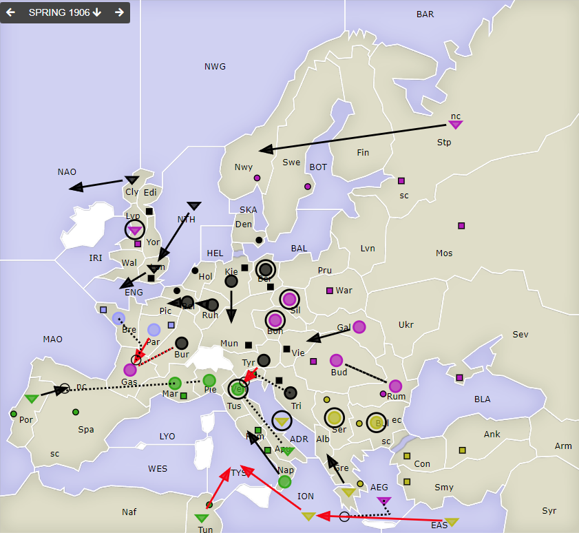
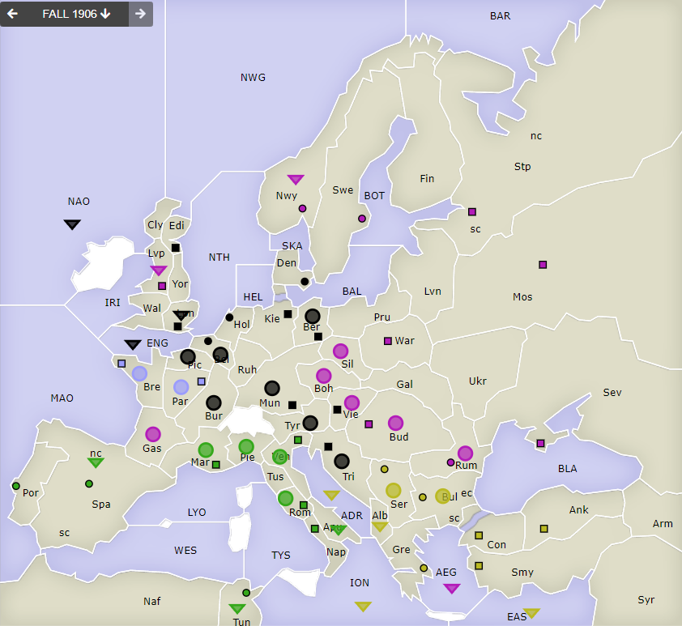

# Dippy "Atari", 1906 Frühjahr

**Navigation**: [index](index.md) // [<- 1905 Herbst](dippy-a1905h.md) // 1906 Frühjahr //  [-> 1906 Herbst/Winter](dippy-a1906h.md) 

---

## Züge

| Austria | England | France            | Germany          | Italy             | Russia              | Turkey            |
|---------|---------|-------------------|------------------|-------------------|---------------------|-------------------|
| /       | /       | <u>A Par-Gas</u>  | A Bel-Pic        | <u>F Tun-TYS</u>  | F AEG S GeF         | F ADR hld         |
|         |         | A Bre S "         | A Ber hld $      | A Ven hld         | &nbsp; EAS-ION      | A Bul hld         |
|         |         |                   | A Bur S RuA      | F Apu S "         | A Boh hld           | <u>F EAS-ION</u>  |
|         |         |                   | &nbsp; Gas hld   | F Por-SpN         | A Rum S Bud&darr;   | F Gre-Alb         |
|         |         |                   | F Cly-NAO        | A Mar S "         | A Bud S Rum&uarr;   | <u>F ION-TYS</u>  |
|         |         |                   | A Kie-Mun        | A Pie S A         | A Gal-Vie           | A Ser hld         |
|         |         |                   | F Lon-ENG        | &nbsp; Mar hld    | <u>A Gas S Bur</u>  |                   |
|         |         |                   | F NTH-Lon        | A Nap-Rom         | F Lvp hld           |                   |
|         |         |                   | A Ruh-Bel        |                   | A Sil hld           |                   |
|         |         |                   | <u>A Tyr-Ven</u> |                   | F StN-BAR           |                   |
|         |         |                   | A Tri S "        |                   |                     |                   |
{: .orders}

Anmerkungen: 
 * `Ru F Stp-Nwy` habe ich geändert zu `Ru F StN-Nwy` -- es ist für den Spieler kein Muss, die Küste anzugeben, an der die Flotte ist, es ist aber eine gute Übung.
 * Germany hat der `A Ber` Urlaub an der Spree gegeben. `$` = No Orders Received.
 * Während der Sultan die gewohnten Ich-schau-nur-zu-Haltezüge gemacht hat, wird der Zar wohl nervös und fängt mit gegenseitigen-Halteunterstützungen an.
 * Ja, das wird sehr eng an der Seine. Mit der guten Verteidigung am Po (sic!) ist am Tiber aber noch nichts verloren.  
 

## Zentren

| Austria     | England | France    | Germany     | Italy       | Russia      | Turkey      |
|-------------|---------|-----------|-------------|-------------|-------------|-------------|
| /           | /       |           | Lon Bel Tri | Por         |             |             |
|             |         | Par Bre   | Ber Mun Kie | Ven Rom Nap | Mos War Stp | Con Smy Ank |
|             |         |           | Den Hol Vie | Tun Mar Spa | Sev Rum Nwy | Bul Gre Ser |
|             |         |           | Edi         |             | Swe Bud Lvp |             |
{: .orders}

**Freie Zentren:** 
/

## Nächste Runde

Bis nächsten Sonntag 17 Uhr hätte ich gerne:

 * **Befehle an die Einheiten**
 * **Potenzielle Rückzüge** (Bedingungen an Züge anderer sind möglich) -- fehlt dies, ist das meist nicht schlimm.
 * **Winterauf- und Abbauten** (auch hier sind Bedingungen an die neue Situation möglich) -- bitte nicht vergessen! 
 

Zum Beispiel so:

    Partie: Dippy Atari
    Runde: 1906 Herbst/Winter
    Nation: Switzerland
    Spieler: Max Mustermann
    Befehle:

       A Dip-DOP       > Din,Dum
       A Dum S Dip-DOP
       F DAP hld       > DUK

       + A Dag, + F Duv
       - F DAP 

Bis dann!
