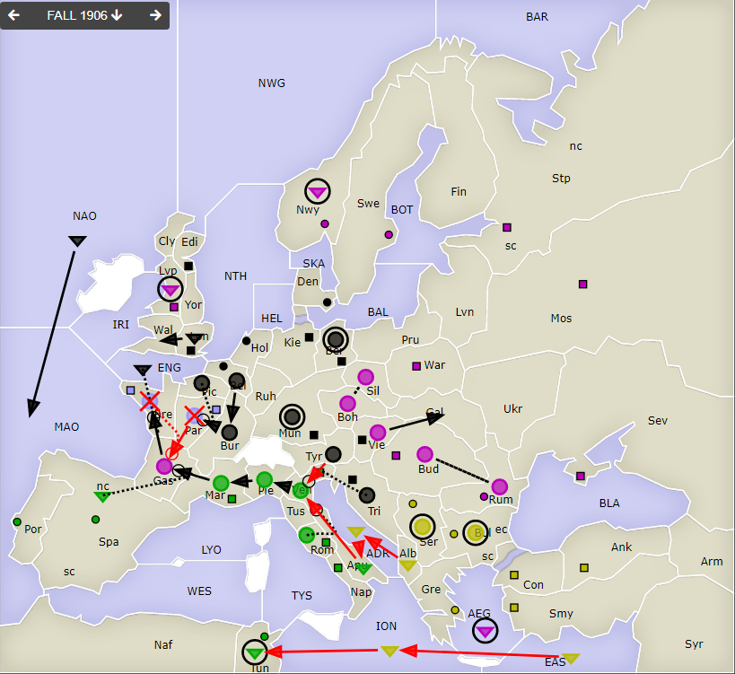
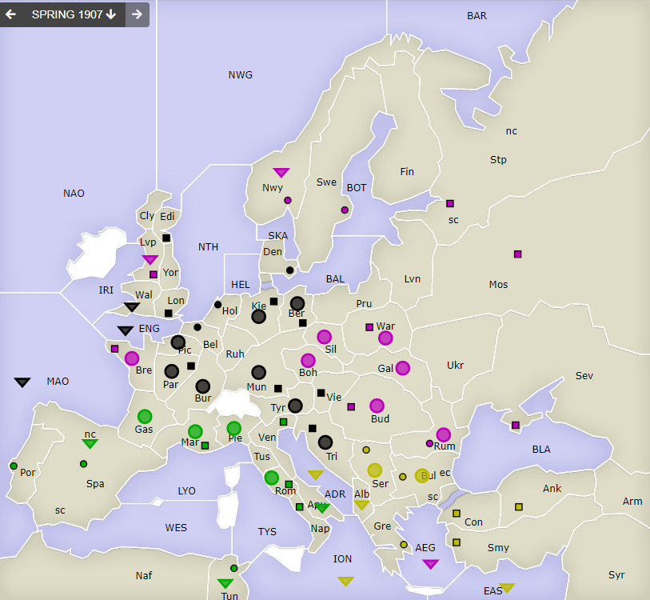

# Dippy "Atari", 1906 Herbst+Winter

**Navigation**: [index](index.md) // [<- 1906 Frühjahr](dippy-a1906f.md) // 1906 Herbst/Winter //  [-> 1907 Frühjahr](dippy-a1907f.md) 

---

## Züge

| Austria          | England          | France           | Germany          | Italy            | Russia       | Turkey           |
|------------------|------------------|------------------|------------------|------------------|--------------|------------------|
|                  |                  | <u>A Par-Gas</u> | A Bel-Bur        | <u>F Apu-Ven</u> | F AEG hld    | <u>F ADR-Apu</u> |
|                  |                  | &nbsp; &gt; ex   | A Ber hld $      | A Rom S "        | A Boh S Sil  | <u>F Alb-ADR</u> |
|                  |                  | <u>A Bre S "</u> | A Bur-Par        | A Mar-Gas        | A Sil S Boh  | A Bul hld        |
|                  |                  | &nbsp; &gt; ex   | A Pic S "        | A Pie-Mar        | A Gas-Bre    | <u>F EAS-ION</u> |
|                  |                  |                  | F ENG SRuA       | F SpN S "        | F Lvp hld    | <u>F ION-Tun</u> |
|                  |                  |                  | &nbsp; Gas-Bre   | F Tun hld        | F Nwy hld    | A Ser hld        |
|                  |                  |                  | F Lon-Wal        | A Ven-Pie        | A Rum S Bud  |                  |
|                  |                  |                  | A Mun hld $      |                  | A Bud S Rum  |                  |
|                  |                  |                  | F NAO-MAO        |                  | A Vie-Gal    |                  |
|                  |                  |                  | <u>A Tyr-Ven</u> |                  |              |                  |
|                  |                  |                  | A Tri S "        |                  |              |                  |
: .orders}

Anmerkungen und Gedanken: 

* `$`: Die Einheiten `Ge A Ber` und `Ge A Mun` haben beide keine Befehle bekommen und hielten harmlos.
* France... hat bis zum Ende gekämpft.
* Wenn das mit dem alphabetischen Ausscheiden so weiter geht, ist jetzt Germany dran ;-)
* Spannendes Patt in `Ven`: `It A Ven` verlässt zwar erfolgreich das Feld, aber sowohl `It` als auch `Ge` kommen beide mit Stärke 2 nicht rein.
* In `Tun` hat der Italiener nichts riskiert und dem Türken keinen Platz gemacht. Dort daher keine Bewegungen.
 

## Zentren

| Austria     | England | France    | Germany     | Italy       | Russia      | Turkey      |
|-------------|---------|-----------|-------------|-------------|-------------|-------------|
| /           | /       |           | Lon Bel Tri | Por         | +Bre        |             |
|             |         | -Par -Bre | Ber Mun Kie | Ven Rom Nap | Mos War Stp | Con Smy Ank |
|             |         |           | Den Hol Vie | Tun Mar Spa | Sev Rum Nwy | Bul Gre Ser |
|             |         |           | Edi +Par    |             | Swe Bud Lvp |             |
{: .orders}

**Freie Zentren:** 
/

## Winterkorrekturen

| Austria     | England | France | Germany | Italy | Russia | Turkey |
|-------------|---------|--------|---------|-------|--------|--------|
| /           | /       | /      | +A Kie  |       | +A War |        |
|             |         |        |         |       |        |        |
{: .orders}

## Nächste Runde

Die Frühjahrszüge (evtl. mit Rückzügen) hätte ich gerne bis Sonntag 17 Uhr.

Ich hätte gerne:

 * **Befehle an die Einheiten**
 * **Potenzielle Rückzüge** (Bedingungen an Züge anderer sind möglich) -- fehlt dies, ist das meist nicht schlimm.

Zum Beispiel so:

    Partie: Dippy Atari
    Runde: 1906 Frühjahr
    Nation: Switzerland
    Spieler: Max Mustermann
    Befehle:

       A Dip-DOP       > Din,Dum
       A Dum S Dip-DOP
       F DAP hld       > DUK

Bis dann!
