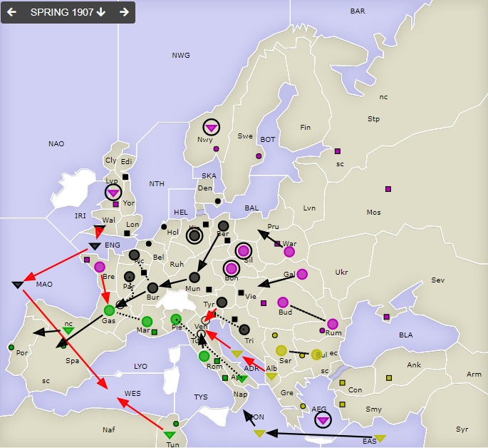
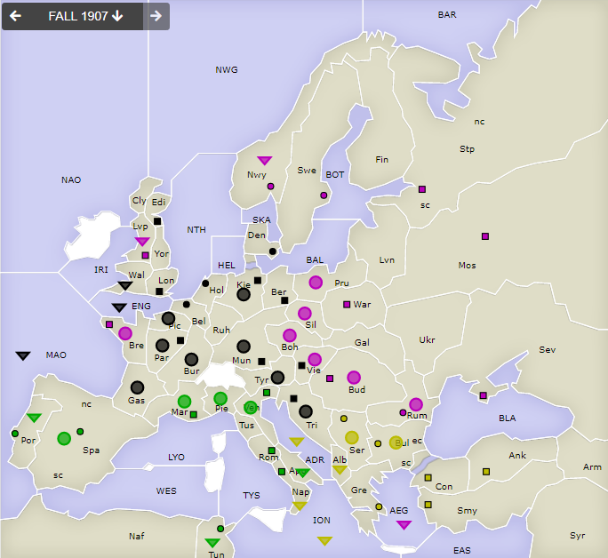

# Dippy "Atari", 1907 Frühjahr

**Navigation**: [index](index.md) // [<- 1906 Herbst](dippy-a1906h.md) // 1907 Frühjahr //  [-> 1907 Herbst/Winter](dippy-a1907h.md) 

---

## Züge

Germany

| Austria | England | France | Germany                 | Italy            | Russia           | Turkey           |
|---------|---------|--------|-------------------------|------------------|------------------|------------------|
| /       | /       | /      | A Ber-Mun               | A Rom-Ven        | F AEG hld        | <u>F ADR-Ven</u> |
|         |         |        | <u>F Wal-ENG</u>        | F Apu S "        | A Boh hld        | <u>F Alb-ADR</u> |
|         |         |        | <u>F ENG-MAO</u>        | A Pie S "        | <u>A Bre-Gas</u> | A Bul S Ser      |
|         |         |        | A Kie hld $             | A Gas-Spa        | A Bud S Rum      | A Ser S Bul      |
|         |         |        | <u>F MAO-WES</u>        | A Mar S Gas      | A Rum S Bud      | F EAS-ION        |
|         |         |        | A Mun-Bur               | F SpN-Por        | A Gal-Vie        | F ION-Nap        |
|         |         |        | A Bur-Gas               | <u>F Tun-WES</u> | F Lvp hld        |                  |
|         |         |        | A Par S "               |                  | F Nwy hld        |                  |
|         |         |        | <u>A Pic S A</u>        |                  | A Sil hld        |                  |
|         |         |        | &nbsp; <u>Bur hld</u> % |                  | A War-Pru        |                  |
|         |         |        | <u>A Tyr-Ven</u>        |                  |                  |                  |
|         |         |        | A Tri S "               |                  |                  |                  |
{: .orders}

Anmerkungen: 
 * `%` No Such Order -- nur *Unterstützungen* kann man beim Halten unterstützen, nicht Bewegungen. Also hält `Ga A Pic` stattdessen.
 * `$` No Orders Received -- kein Zug für `Ge A Kie`.

Gedanken:
 * Whow, kein einziger Rückzug! Nicht dass es nicht versucht wurde.
 * In `Gas` setzt sich der Deutsche gegen den Russen durch. Interessant.
 * In `Ven` haben sich Turkey und Deutschland nicht abgesprochen, vielleicht? 
   Jedoch hätte das zusammen nach `Ven` supporten alleine nicht gereicht. 
   Turkey hätte zusätzlich noch mit `Tu F ION` den Support aus `It F Apu` abschneiden müssen. 
   Aber dann wäre `Tu F EAS` nicht rausgekommen und das wäre vielleicht langfristig döfer gewesen.
 * Diesmal unterstützt auch `Tu A Ser` und `Tu A Bul` gegenseitig beim Halten -- wie der Russe gegenüber auch schon ein paar mal.
 * Der Deutsche konnte aus `WES` rausgehalten werden. `WES` wird scheinbar gerade der Schlüssel zu mittleren Atlantik. 
 

## Zentren

| Austria | England | France | Germany     | Italy       | Russia      | Turkey      |
|---------|---------|--------|-------------|-------------|-------------|-------------|
| /       | /       | /      | Lon Bel Tri | Por         |  Bre        |             |
|         |         |        | Ber Mun Kie | Ven Rom Nap | Mos War Stp | Con Smy Ank |
|         |         |        | Den Hol Vie | Tun Mar Spa | Sev Rum Nwy | Bul Gre Ser |
|         |         |        | Edi  Par    |             | Swe Bud Lvp |             |
{: .orders}

**Freie Zentren:** 
/

## Nächste Runde

Bis nächsten Sonntag 17 Uhr hätte ich gerne:

 * **Befehle an die Einheiten**
 * **Potenzielle Rückzüge** (Bedingungen an Züge anderer sind möglich) -- fehlt dies, ist das meist nicht schlimm.
 * **Winterauf- und Abbauten** (auch hier sind Bedingungen an die neue Situation möglich) -- bitte nicht vergessen! 
 

Zum Beispiel so:

    Partie: Dippy Atari
    Runde: 1907 Herbst/Winter
    Nation: Switzerland
    Spieler: Max Mustermann
    Befehle:

       A Dip-DOP       > Din,Dum
       A Dum S Dip-DOP
       F DAP hld       > DUK

       + A Dag, + F Duv
       - F DAP 

Bis dann!
