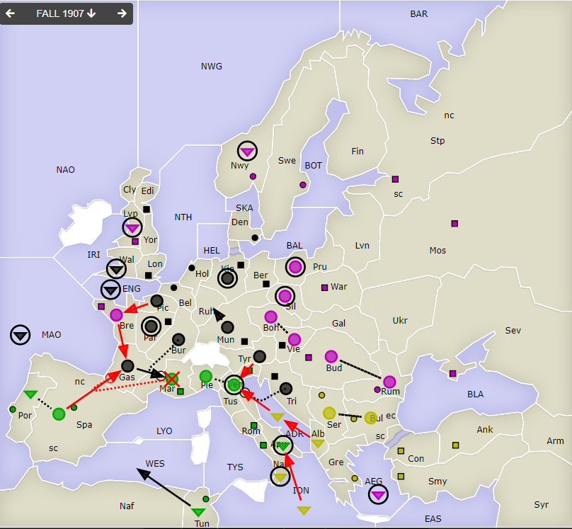
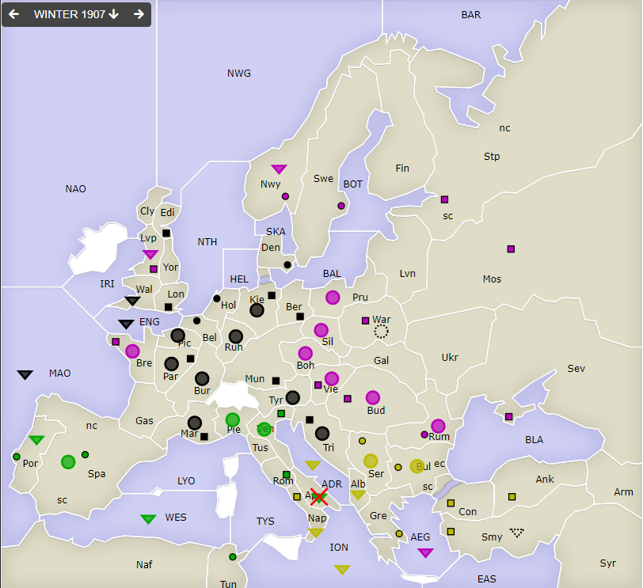
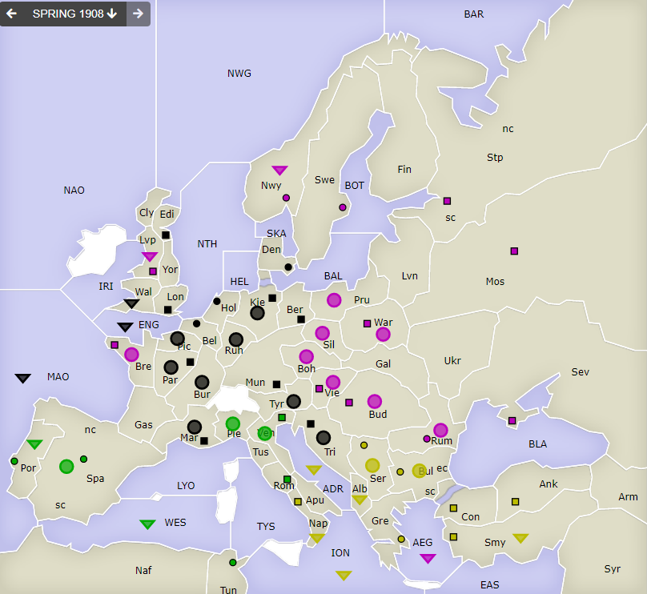

# Dippy "Atari", 1907 Herbst+Winter

**Navigation**: [index](index.md) // [<- 1907 Frühjahr](dippy-a1907f.md) // 1907 Herbst/Winter //  [-> 1908 Frühjahr](dippy-a1908f.md) 

---

## Züge

| Austria | England | France | Germany            | Italy                  | Russia           | Turkey           |
|---------|---------|--------|--------------------|------------------------|------------------|------------------|
| /       | /       | /      | F ENG hld $        | F Apu hld              | F AEG hld        | <u>F ADR-Ven</u> |
|         |         |        | A Gas-Mar          | <u>A Spa-Gas</u>       | A Vie S &darr;   | <u>F Alb-ADR</u> |
|         |         |        | A Bur S "          | <u>A Mar S "</u>       | A Boh S &uarr;   | <u>F ION-Apu</u> |
|         |         |        | A Kie hld $        | &nbsp; &gt; ex         | <u>A Bre-Gas</u> | F Nap hld        |
|         |         |        | <u>F MAO-Spa</u> ? | A Pie S Ven            | A Rum S &darr;   | A Bul S &darr;   |
|         |         |        | A Mun-Ruh          | <u>F Por S A</u>       | A Bud S &uarr;   | A Ser S &uarr;   |
|         |         |        | A Par hld $        | &nbsp;<u>Spa hld</u> § | F Lvp hld        |                  |
|         |         |        | <u>A Pic-Bre</u>   | F Tun-WES              | F Nwy hld        |                  |
|         |         |        | A Tri STuF         | A Ven hld              | A Pru hld        |                  |
|         |         |        | &nbsp; ADR-Ven     |                        | A Sil hld        |                  |
{: .orders}

Anmerkungen und Gedanken: 

* &darr;/&uarr; -- Gegenseite Unterstützung beim Halten.
* `$` -- No Orders Received, aber das war von Deutschland wohl geplant. Doitsche Effizienz.
* `?` -- Äh `Ge F MAO-Spa` geht nicht, weil nicht klar ist, an welche Küste gezogen wird. Also hält `Ge F MAO`. Macht aber nix, hätte nichts geändert, denn `It A Spa-Gas` hat nicht geklappt.
* `§` -- So Such Order. Beim Halten kann man nicht unterstützen, wenn die Zieleinheit einen Bewegungsbefehl bekommen hat. Für Supports macht man das so!
* Andreas hat gesagt, ich darf ihn zitieren mit *"Oh, `Ge A Tyr-Ven` war ja doof, das sollte eigentlich `Pie` sein."* War es aber nicht. :shrug: `It A Ven` verteidigt erfolgreich.
* `It Mar` ist jedoch gefallen. Und mangels Zentrum wird später `It F Apu` abgebaut. Uiui.
* Ansonsten wenig Bewegung: Viel nicht erfolgreich, viel direktes Halten.
 

## Zentren

| Austria | England | France | Germany      | Italy        | Russia      | Turkey      |
|---------|---------|--------|--------------|--------------|-------------|-------------|
| /       | /       | /      | Lon Bel Tri  | Por          | Bre +Vie    |             |
|         |         |        | Ber Mun Kie  | Ven Rom -Nap | Mos War Stp | Con Smy Ank |
|         |         |        | Den Hol -Vie | Tun -Mar Spa | Sev Rum Nwy | Bul Gre Ser |
|         |         |        | Edi Par +Mar |              | Swe Bud Lvp | +Nap        |
|         |         |        | /11          | /5           | /11         | /7          |
{: .orders}

**Freie Zentren:** 
/

## Winterkorrekturen

| Austria     | England | France | Germany | Italy  | Russia | Turkey |
|-------------|---------|--------|---------|--------|--------|--------|
| /           | /       | /      | -       | -F Apu | +A War | +F Smy |
|             |         |        |         |        |        |        |
{: .orders}

## Nächste Runde

Die Frühjahrszüge (evtl. mit Rückzügen) hätte ich gerne bis Sonntag 17 Uhr.

Ich hätte gerne:

 * **Befehle an die Einheiten**
 * **Potenzielle Rückzüge** (Bedingungen an Züge anderer sind möglich) -- fehlt dies, ist das meist nicht schlimm.

Zum Beispiel so:

    Partie: Dippy Atari
    Runde: 1907 Frühjahr
    Nation: Switzerland
    Spieler: Max Mustermann
    Befehle:

       A Dip-DOP       > Din,Dum
       A Dum S Dip-DOP
       F DAP hld       > DUK

Bis dann!
