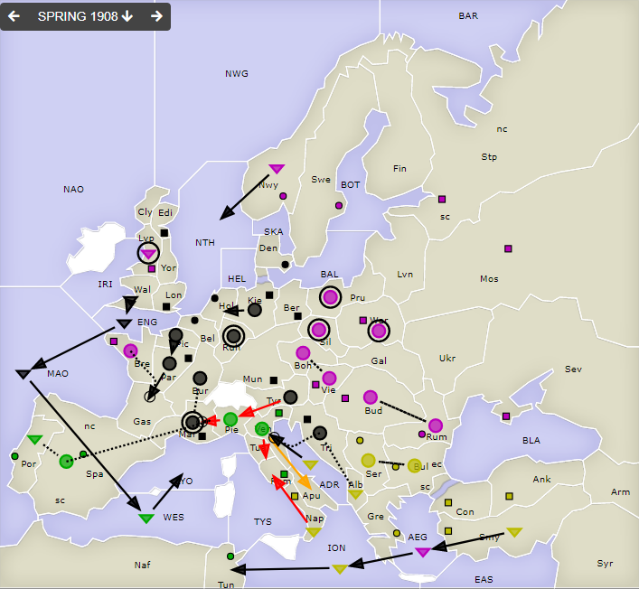
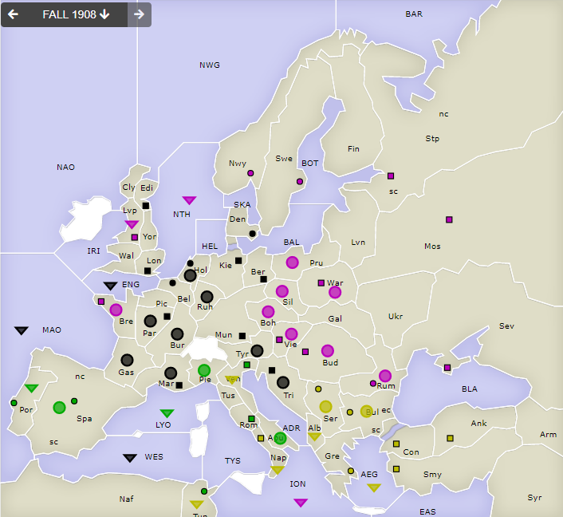

# Dippy "Atari", 1908 Frühjahr

**Navigation**: [index](index.md) // [<- 1907 Herbst](dippy-a1907h.md) // 1908 Frühjahr //  [-> 1908 Herbst/Winter](dippy-a1908h.md) 

---

## Züge

| Austria | England | France | Germany          | Italy             | Russia         | Turkey           |
|---------|---------|--------|------------------|-------------------|----------------|------------------|
| /       | /       | /      | F ENG-MAO        | <u>A Pie-Mar</u>  | F AEG-ION      | F ADR-Ven        |
|         |         |        | A Kie-Hol        | A Spa S "         | A Boh S Vie    | F Alb SGeA       |
|         |         |        | F MAO-WES        | F Por S Spa       | A Vie S Boh    | &bbsp; Tri hld   |
|         |         |        | A Mar hld        | <u>A Ven-Rom</u>  | A Bre SGeA     | A Bul S Ser      |
|         |         |        | A Bur S "        | &nbsp; &gt; Apu $ | &nbsp; Par-Gas | A Ser S Bul      |
|         |         |        | A Par-Gas        | F WES-LYO         | F Lvp hld      | F ION-Tun        |
|         |         |        | A Pic-Par        |                   | F Nwy-NTH      | <u>F Nap-Rom</u> |
|         |         |        | A Ruh hld        |                   | A Pru hld      | F Smy-AEG        |
|         |         |        | A Tri STuF       |                   | A Bud S Rum    |                  |
|         |         |        | &nbsp; ADR-Ven   |                   | A Rum S Bud    |                  |
|         |         |        | <u>A Tyr-Pie</u> |                   | A Sil hld      |                  |
|         |         |        | F Wal-ENG        |                   | A War hld      |                  |
{: .orders}

Gedanken: 
 * Diesmal lief der deutsch-türkische Angriff mit Effi- und Konsequenz. Venedig und Tunis fielen, Marseille konnte gehalten werden. Und auch um Mittelmeer wird's dem Italiener warm.
 * Im russischen Hinterland -- so kann man Pru/War/Sil/Boh/Bud/Rum jetzt wohl nennen -- ist dagegen alles eingefroren. Nur ein paar winzige Bewegungen im kalten norwegischen Winter und heißen Südmeer sind möglich.

## Zentren

| Austria | England | France | Germany     | Italy       | Russia      | Turkey      |
|---------|---------|--------|-------------|-------------|-------------|-------------|
| /       | /       | /      | Lon Bel Tri |             | Bre Vie     |             |
|         |         |        | Ber Mun Kie | Ven Rom-Nap | Mos War Stp | Con Smy Ank |
|         |         |        | Den Hol Mar | Tun Por Spa | Sev Rum Nwy | Bul Gre Ser |
|         |         |        | Edi Par     |             | Swe Bud Lvp | Nap         |
|         |         |        | /11         | /5          | /11         | /7          |
{: .orders}

**Freie Zentren:** 
/

## Nächste Runde

Bis nächsten Sonntag 17 Uhr hätte ich gerne:

 * **Befehle an die Einheiten**
 * **Potenzielle Rückzüge** (Bedingungen an Züge anderer sind möglich) -- fehlt dies, ist das meist nicht schlimm.
 * **Winterauf- und Abbauten** (auch hier sind Bedingungen an die neue Situation möglich) -- bitte nicht vergessen! 
 

Zum Beispiel so:

    Partie: Dippy Atari
    Runde: 1908 Herbst/Winter
    Nation: Switzerland
    Spieler: Max Mustermann
    Befehle:

       A Dip-DOP       > Din,Dum
       A Dum S Dip-DOP
       F DAP hld       > DUK

       + A Dag, + F Duv
       - F DAP 

Bis dann!
