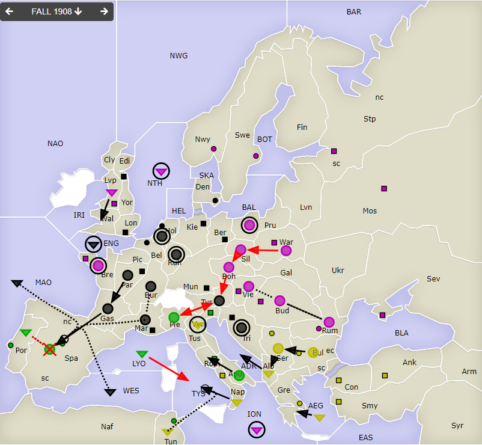
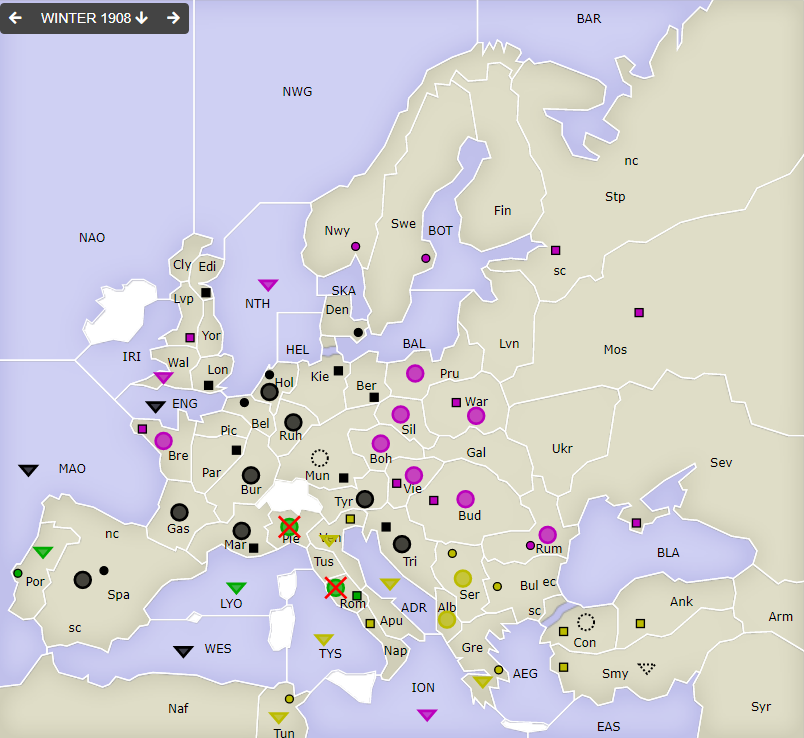
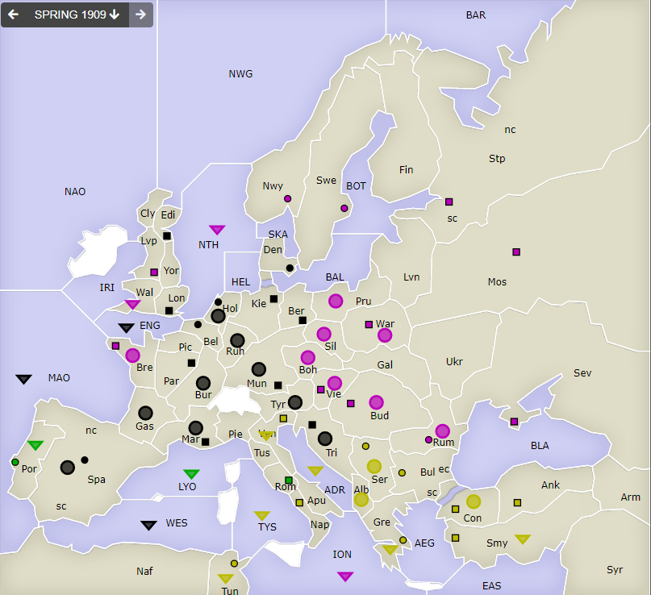

# Dippy "Atari", 1908 Herbst+Winter

**Navigation**: [index](index.md) // [<- 1908 Frühjahr](dippy-a1908f.md) // 1908 Herbst/Winter //  [-> 1909 Frühjahr](dippy-a1909f.md) 

---

## Züge

| Austria | England | France | Germany          | Italy              | Russia           | Turkey     |
|---------|---------|--------|------------------|--------------------|------------------|------------|
 |         |         |        | F ENG hld        | A Apu-Rom          | <u>A Boh-Tyr</u> | F AEG-Gre  |
 |         |         |        | A Gas-Spa        | <u>F LYO-TYS</u>   | A Bre hld        | F Alb-ADR  |
 |         |         |        | F MAO S "        | <u>A Pie-Tyr</u>   | A Rum S Bud      | A Bul-Ser  |
 |         |         |        | A Mar S "        | F Por S Spa        | A Bud S Rum      | F Nap-TYS  |
 |         |         |        | F WES S "        | <u>A Spa S Por</u> | F ION hld        | F Tun S "  |
 |         |         |        | A Bur S Mar      | &nbsp; &gt; ex     | F Lvp-Wal        | A Ser-Alb  |
 |         |         |        | A Hol hld        |                    | F NTH hld        | F Ven hld  |
 |         |         |        | A Par-Gas        |                    | A Pru hld        |            |
 |         |         |        | A Ruh hld        |                    | <u>A Sil-Boh</u> |            |
 |         |         |        | A Tri hld        |                    | A Vie S Bud      |            |
 |         |         |        | <u>A Tyr-Pie</u> |                    | <u>A War-Sil</u> |            |
{: .orders}

Anmerkungen und Gedanken: 

* Volle Wucht gegen `It A Spa` und Erfolg.
* Dafür kann `It A Pie` aber halten
* `Tu A Ven hld`? 
* Nach Abbauten Italien fast menschenleer.
 

## Zentren

| Austria | England | France | Germany     | Italy       | Russia      | Turkey      |
|---------|---------|--------|-------------|-------------|-------------|-------------|
| /       | /       | /      | Lon Bel Tri |             | Bre Vie     |             |
|         |         |        | Ber Mun Kie |-Ven Rom     | Mos War Stp | Con Smy Ank |
|         |         |        | Den Hol Mar |-Tun Por-Spa | Sev Rum Nwy | Bul Gre Ser |
|         |         |        | Edi Par+Spa |             | Swe Bud Lvp | Nap+Ven+Tun |
|         |         |        | /12         | /2          | /11         | /9          |
{: .orders}

**Freie Zentren:** 
/

## Winterkorrekturen

| Austria     | England | France | Germany | Italy  | Russia | Turkey |
|-------------|---------|--------|---------|--------|--------|--------|
| /           | /       | /      | +A Mun  | -A Pie | -      | +F Smy |
|             |         |        |         | -A Rom |        | +A Con |
{: .orders}

## Nächste Runde

Die Frühjahrszüge (evtl. mit Rückzügen) hätte ich gerne bis Sonntag 17 Uhr.

Ich hätte gerne:

 * **Befehle an die Einheiten**
 * **Potenzielle Rückzüge** (Bedingungen an Züge anderer sind möglich) -- fehlt dies, ist das meist nicht schlimm.

Zum Beispiel so:

    Partie: Dippy Atari
    Runde: 1908 Frühjahr
    Nation: Switzerland
    Spieler: Max Mustermann
    Befehle:

       A Dip-DOP       > Din,Dum
       A Dum S Dip-DOP
       F DAP hld       > DUK

Bis dann!
