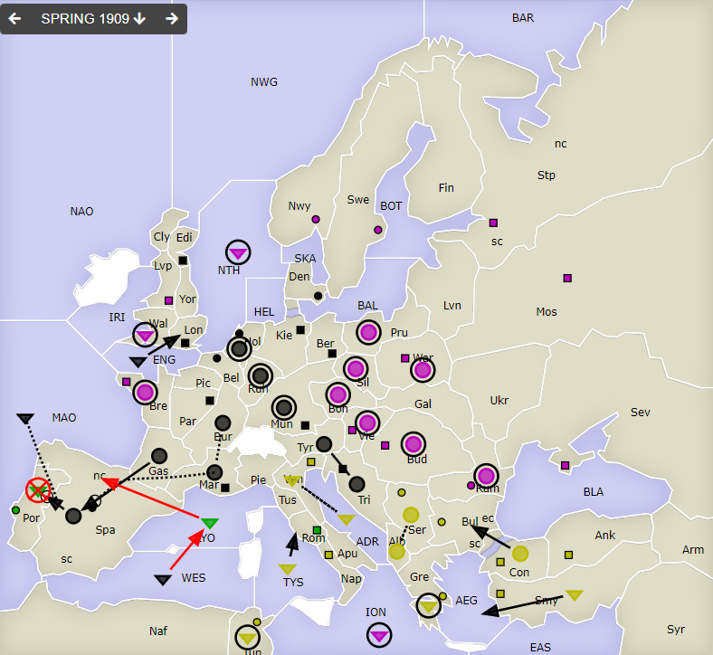
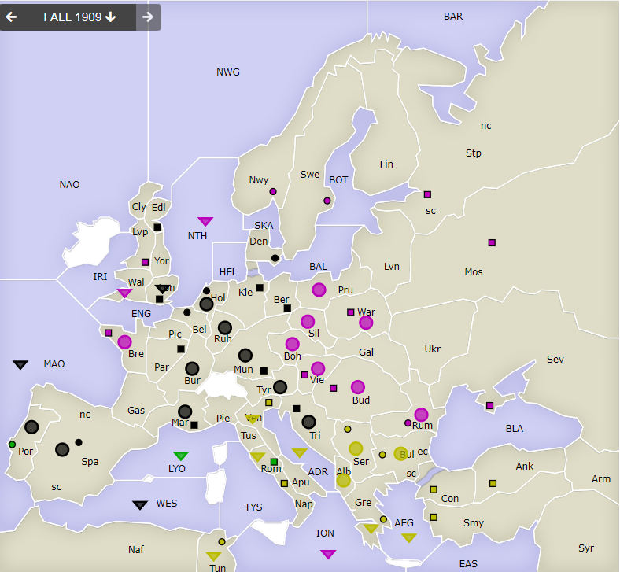

# Dippy "Atari", 1909 Frühjahr

**Navigation**: [index](index.md) // [<- 1907 Herbst](dippy-a1907h.md) // 1909 Frühjahr //  [-> 1910 Herbst/Winter](dippy-a1910h.md) 

---

## Züge

| Austria | England | France | Germany          | Italy             | Russia     | Turkey        |
|---------|---------|--------|------------------|-------------------|------------|---------------|
| -       | -       | -      | A Bur S Mar      | <u>F LYO-SpN</u>  | A Boh hld  | A Alb S Ser   |
|         |         |        | F ENG-Lon        | <u>F Por hld</u>  | A Bre hld  | A Ser S Alb   |
|         |         |        | A Gas-Spa        | &nbsp; &gt; ex    | A Bud hld  | A Con-Bul     |
|         |         |        | A Mar S "        |                   | F ION hld  | F Gre hld     |
|         |         |        | A Hol H          |                   | F NTH hld  | F Smy-AEG     |
|         |         |        | A Mun hld        |                   | A Pru hld  | F Tun hld     |
|         |         |        | A Ruh hld        |                   | A Rum hld  | F TYS-Rom     |
|         |         |        | A Spa-Por        |                   | A Sil hld  | F Ven S ADR   |
|         |         |        | F MAO S "        |                   | A Vie hld  | F ADR S Ven   |
|         |         |        | A Tri S Tyr      |                   | F Wal hld  |               |
|         |         |        | A Tyr S Tri      |                   | A War hld  |               |
|         |         |        | <u>F WES-LYO</u> |                   |            |               |
{: .orders}

Gedanken und Bemerkungen: 
 * `!` -- Invalid Move Path -- Eine Flotte kann vom Mittelmeer nicht direkt an die Nordküste Spaniens ziehen.
 * Sieht bei Russland aus wie ein "NMR" (No Moves Received; Spieler hat keine Züge abgegeben), war's aber nicht 
 * Bei Turkey hat einfach alles geklappt; bei Germany auch denn der Zug nach LYO war bestimmt eingeplant, dass der nicht klappt. 

Eine Einheit hat er noch, der Italiener.

**Darum bitte ich diesmal um eine zusätzliches Zugabgabe-Element**

> Wenn alle nach den Winterkorrekturen noch auf auf dem Brett beteiligten Spieler
> für "Spielende: ja" stimmen, dann wird die Partie mit einem "Draw" als beendet erklärt.

Nach manchen Zählarten ("DIAS" genannt; Draw Including All Survivors) 
haben alle dann noch auf dem Brett befindlichen Nationen **zu gleichen Teilen** gewonnen; das ist die offizielle
Regel aus dem Regelwerk. Tatsächlich wird sie jedoch aktuell seltenen angewendet.

Es gibt es [Statistiken](https://world-diplomacy-database.com/php/scoring/scoring.php) (Dippy-Ligen etc), bei den Draws anders bewertet werden, 
z.B. zählt bei in der [Armada-Zählweise](https://world-diplomacy-database.com/php/scoring/scoring_class.php?id_scoring=11) der
Einzelsiehg 104 Punkte, der 3-Wege-Draw 56 Punkte.

In manche Zählungen fließen
auch die Anzahl der Zentren im Draw mit ein,
zB bei der [AvalonCon 1992](https://world-diplomacy-database.com/php/scoring/scoring_class.php?id_scoring=40)
Zählart ein alleiniger Sieg 15 Punkte, ein 3-Wege-Draw 4 Punkte -- **plus** jeweils die Anzahl der Zentren.

Und viele Varianten mit in welchem Jahr, und sogar mit Ausgleichspunkten für die Nation.

## Zentren

| Austria | England | France | Germany     | Italy    | Russia      | Turkey      |
|---------|---------|--------|-------------|----------|-------------|-------------|
| /       | /       | /      | Lon Bel Tri |          | Bre Vie     |             |
|         |         |        | Ber Mun Kie | Rom Por  | Mos War Stp | Con Smy Ank |
|         |         |        | Den Hol Mar |  | Sev Rum Nwy | Bul Gre Ser |
|         |         |        | Edi Par Spa |          | Swe Bud Lvp | Nap Ven Tun |
|         |         |        | /12         | /2       | /11         | /9          |
{: .orders}

**Freie Zentren:** 
/

## Nächste Runde

Bis nächsten Sonntag 17 Uhr hätte ich gerne:

 * **Befehle an die Einheiten**
 * **Potenzielle Rückzüge** (Bedingungen an Züge anderer sind möglich) -- fehlt dies, ist das meist nicht schlimm.
 * **Winterauf- und Abbauten** (auch hier sind Bedingungen an die neue Situation möglich) -- bitte nicht vergessen! 
 * **Abstimmung Spielende: Ja/Nein** (Ein nicht eindeutig erkennbares "Ja" zählt als Nein) 

Zum Beispiel so:

    Partie: Dippy Atari
    Runde: 1909 Herbst/Winter
    Nation: Switzerland
    Spieler: Max Mustermann
    Befehle:

       A Dip-DOP       > Din,Dum
       A Dum S Dip-DOP
       F DAP hld       > DUK

       + A Dag, + F Duv
       - F DAP 

     Spielende: Jein.

Bis dann!
