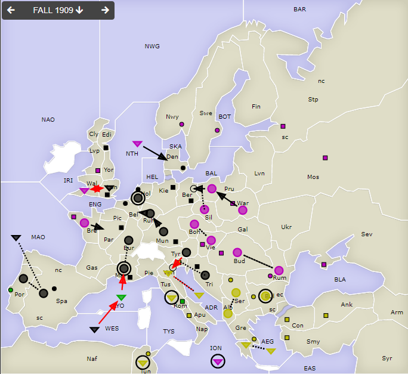
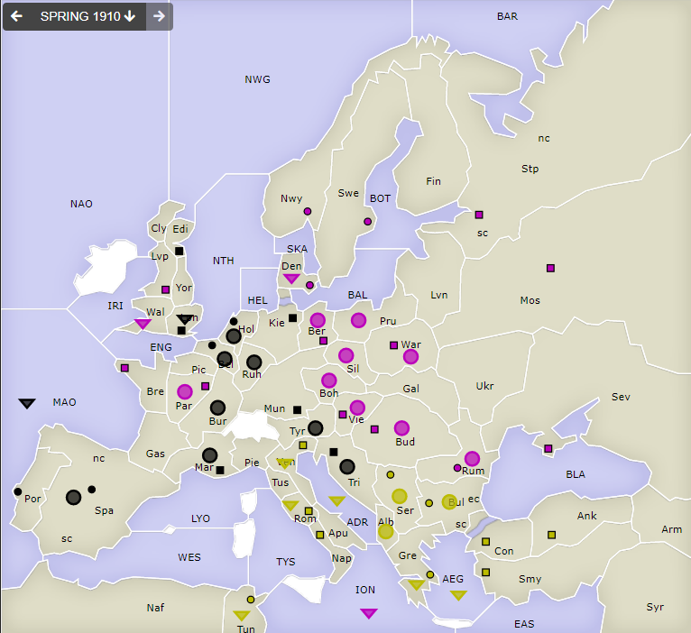

# Dippy "Atari", 1909 Herbst+Winter

**Navigation**: [index](index.md) // [<- 1909 Frühjahr](dippy-a1909f.md) // 1909 Herbst/Winter //  - 

---

## Züge

| Austria | England | France | Germany          | Italy            | Russia           | Turkey            |
|---------|---------|--------|------------------|------------------|------------------|-------------------|
| -       | -       | -      | A Mar hld        | <u>F LYO-Mar</u> | A Boh S Vie      | F ADR S Ven       |
|         |         |        | A Bur S "        |                  | A Vie S Boh      | <u>F Ven S ADR<u> |
|         |         |        | A Hol hld        |                  | A Bre-Par        | F Gre S AEG       |
|         |         |        | <u>F Lon-Wal</u> |                  | A Bud S Rum      | F AEG S Gre       |
|         |         |        | A Por S Spa      |                  | A Rum S Bud      | A Bul hld         |
|         |         |        | A Spa S Por      |                  | F ION hld        | F Rom hld         |
|         |         |        | F MAO S A        |                  | F NTH-Den        | A Ser S Alb       |
|         |         |        | &nbsp; Spa hld   |                  | A Pru-Ber        | A Alb S Ser       |
|         |         |        | A Mun-Ruh        |                  | A Sil S "        | F Tun hld         |
|         |         |        | A Ruh-Bel        |                  | <u>F Wal-Lon</u> |                   |
|         |         |        | <u>A Tyr-Ven</u> |                  |                  |                   |
|         |         |        | A Tri S "        |                  |                  |                   |
{: .orders}

Anmerkungen und Gedanken: 

* Wenige Überraschungen, außer, dass von außen betrachtet die russischen Züge erstaunlich aggressiv waren.

## Zentren

| Austria | England | France | Germany     | Italy    | Russia      | Turkey      |
|---------|---------|--------|-------------|----------|-------------|-------------|
| /       | /       | /      | Lon Bel Tri |          | Bre Vie+Ber |             |
|         |         |        | Mun-Ber Kie | -Rom-Por | Mos War Stp | Con Smy Ank |
|         |         |        | Hol-Den Mar |          | Sev Rum Nwy | Bul Gre Ser |
|         |         |        | Edi-Par Spa |          | Swe Bud Lvp | Nap Ven Tun |
|         |         |        | +Por        |          | +Den+Par    | +Rom        |
|         |         |        | **/10**     | **/0**   | **/14**     | **/10**     |
{: .orders}

**Freie Zentren:** 
/

## Winterkorrekturen

| Austria     | England | France | Germany  | Italy  | Russia | Turkey |
|-------------|---------|--------|----------|--------|--------|--------|
| /           | /       | /      | -A Por $ | -A LYO | +A War | + $    |
|             |         |        | -F WES $ |        |        | + $    |
{: .orders}

## Nächste Runde

Soooo, was sagt denn die Abstimmung: 

> Die drei noch auf dem Spielbrett befindlichen Nationen
> **Germany**, **Russia** und **Turkey** haben für ein
> Unentschieden gestimmt. 

Die Partie ist hier mit beendet.

Spaß hat's gemacht!
