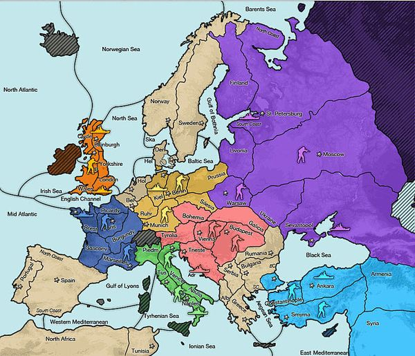

Title: Regeln: Spielelemente
Date: 2022-06-04 21:00
Category: Regeln

# Spielelemente

Hier erwähne ich die Spielelemente in ganz kurz.
Details -- siehe [Regeln](http://www.diplomacy-archive.com/diplomacy_rules.htm).

 * Felder -- werden mit 3 Buchstaben mit Großschreibung abgekürzt: `Por`, `NAT`, `SpN` etc.
    
   * Binnenland 
   * Küste 
   * Meer
   
> **Unterfelder** 
>
> Manche Küstenfelder haben zwei Küsten
> (`Spa`, `Pet`). Flotten sollten bei Bewegung dann angeben, an 
> welche der Küsten sie ziehen. Das ist von `Por` und `MED` nach
> `Spa` relevant. Also nicht `F Por-Spa`, sondern `F Por-SpN`.

> **Schreibweisen**
> 
> Dooferweise sind oft für Meere zwei unterschiedliche
> Abkürzungen üblich. `MID`=`MAO`, `NAT`=`NAO` etc. Glücklicherweise
> gibt es keine Überschdeidungen -- beide Varianten sind gültig. 
> Wer sicher gehen will, darf den Namen auch ausschreiben.

 * Versorgungszentren -- pro Einheit 1 Zentrum
  
   * Heimatversorgungszentren -- hier entstehen neue Einheiten 
    
 * Einheiten -- abgekürzt mit 1 Buchstaben `A` oder `F`.
    
   * Armeen -- dürfen Binnenländer und Küstenfelder betreten
   * Flotten -- dürfen Meer und Küstenfelder betreten
    
 * Nationen -- haben 2 Buchstaben `Au`, `En` etc. 
    
   * Austria, England, France, Russia, Turkey, Italy, Germany.
    
 * Situation -- Liste an Positionen aller Einheiten der Nationen und 
   deren Verorgungszentren

> **Standort**
>
> Um die Position einer Einheit genau zu beschreiben, nennt man
> dessen Nation, Typ und Feld, also zum Beispiel `Fr A Par`.
> Listet man alle `Fr` Einheiten auf, reicht 
> auch `Fr: A Par, F Bre, A Mar`.
>
> Nicht immer ist die aktuelle Situation komplett aufgelistet,
> sondern implizit der Liste der Befehle der letzten Runde
> zu entnehmen.

 * Spieler
 * Befehl -- mit einem Symbol oder 3 Kleinbuchstaben abgekürzt
     
   * Haltebefehl `xxx` oder `sup` -- `A Par hld` oder `A Par xxx` oder `A Par`.
   * Bewegungsbefehl `-` oder `mve` -- `F MAO-NAO` oder `F MAO mve NAO` 
   * Unterstützungsbefehl zum Halten `S` oder `sup` -- `F MID S Bre` oder `F MID sup Bre` 
   * Unterstützungsbefehl zum Bewegen `S` oder `sup` -- `F MID S Bre-Gas` oder `F MID sup Bre mve Gas`
   * Geleitbefehl `C` oder `con` -- `F ENG C Lon-Pie` oder `F ENG con Lon mve Pie`

> **Zieleinheit**
> 
> Die Angabe der Nation oder des Typs der Einheit beim Support
> oder beim Convoy ist optional und wird bei Widerspruch ignoriert.
> 
> Man beachte aber, dass der Bewegungsbefehl beim Support und Convoy
> das Zielfeld der Bewegung enthalten muss.

 * Runden
    
   * Frühjahr -- Bewegungszüge und Rückzüge
   * Herbst -- Bewegungszüge und Rückzüge
   * Winter -- Zählung der Versorgungszentren, Auf- und Abbauten

## Karten

 Startaufstellung.

 Startaufstellung als SVG.
