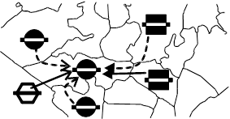

# Rule IX.3. interpretation

## Original Text from DipWork

> **Schalter IX_3_INTERPRETATION**
>
> 
>
> * Art: Zahl
> * Möglichkeiten: 0 | 1 | 2
> * Standardempfehlung:	0
>
> Wenn ein Angreifer normalerweise den Konflikt gewinnt, aber die Einheit im Zielfeld
> dieses nicht verläßt und die Nation der Einheit im Zielfeld den Angreifer unterstützt hat,
> dann gelingt die Bewegung des Angreifers nur wenn:
>
>  * 0: Auch bei Nichtberücksichtigung der Unterstützungen der Nation der Einheit
     >    im Zielfeld für alle Angreifer, diese vertrieben werden würde.
>  * 1: Auch bei Nichtberücksichtigung der Unterstützungen der Nation der Einheit
     >    im Zielfeld für alle Angreifer, derselbe Angreifer den Konflikt gewinnen würde.
>  * 2: Dieser Angriff auch ohne die Unterstützungen der Nation der Einheit
     >    im Zielfeld stärker als die Verteidigungsstärke des Zielfeldes ist.
>
> Im obenstehenden Beispiel bewegte sich die `En F ENG` nicht.
> Die `Fr F MID` gewinnt den Konflikt in `ENG zunächst.
> Nach Regel IX.3. zählen die Unterstützungen des Engländers zu dem Angriff jedoch nicht
> bei einer Vertreibung, werden also in einem zweiten Auswertungsschritt ignoriert.
> Das hat jedoch zur Folge, daß die `Ge F Bel` den Konflikt in `ENG` gewinnen würde.
>
> Bei Schalterstellung "0" gelingt Fr F MID-ENG, weil "En F ENG trotzdem vertrieben wird".
>
> Bei Schalterstellung "1" gelingt weder Fr F MID-ENG noch Ge F Bel-ENG,
> weil "nicht derselbe Angreifer den Konflikt gewinnt".
>
> Bei Schalterstellung "2" gelingt auch keine der Bewegungen: Es wird ohnehin
> nur `Fr F MID-ENG` betrachtet und die kann ohne die englischen Unterstützungen
> nicht vertreiben.

