# DDL Examples

## 01 — Basic Hold

Single unit holding. Trivial baseline.

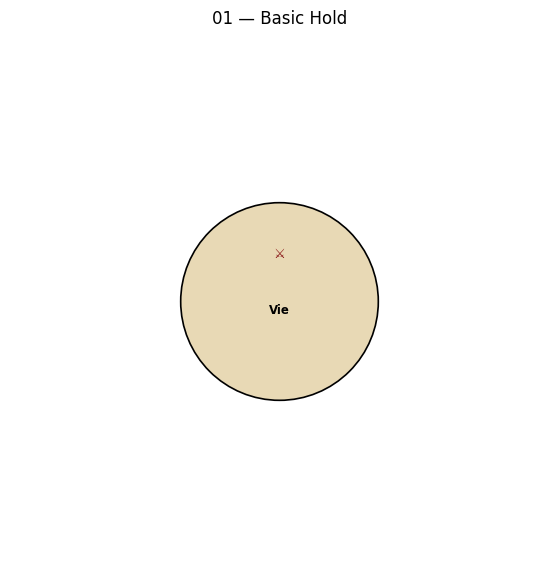

<details><summary>DDL source</summary>

```
@dwex
title: 01 — Basic Hold
desc:  Single unit holding. Trivial baseline.

map {
  Vie LA 0,0
}

orders {
  Au A Vie hld
}
@end

```
</details>

## 02 — Simple Move

Single unit moves to adjacent empty field.

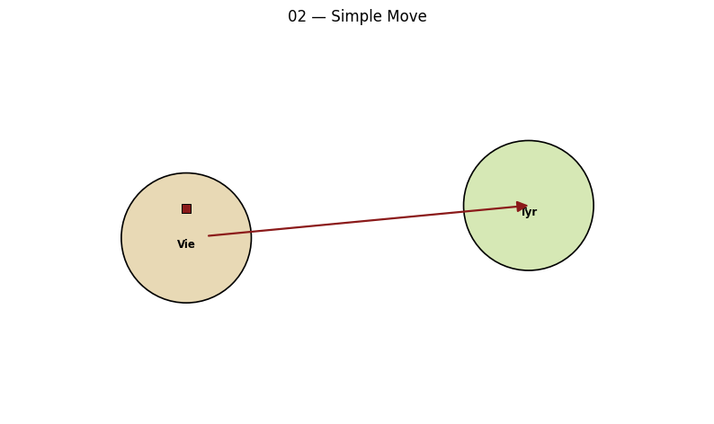

<details><summary>DDL source</summary>

```
@dwex
title: 02 — Simple Move
desc:  Single unit moves to adjacent empty field.

map {
  Vie LA 0,0
  Tyr L  1,0
  Vie -- Tyr
}

orders {
  Au A Vie mve Tyr
}
@end

```
</details>

## 03 — Equal Bounce

Two armies of equal strength move to same field. Both bounce.

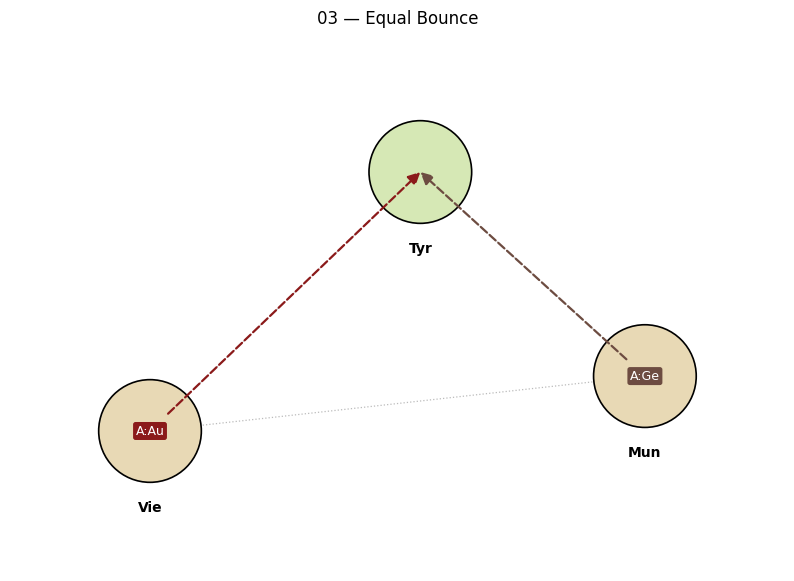

<details><summary>DDL source</summary>

```
@dwex
title: 03 — Equal Bounce
desc:  Two armies of equal strength move to same field. Both bounce.

map {
  Vie LA 0,0
  Mun LA 2,0
  Tyr L  1,1
  Vie -- Mun
  Vie -- Tyr
  Mun -- Tyr
}

orders {
  Au A Vie mve Tyr !
  Ge A Mun mve Tyr !
}
@end

```
</details>

## 04 — Support Hold

A hold-support fends off an equal attacker.

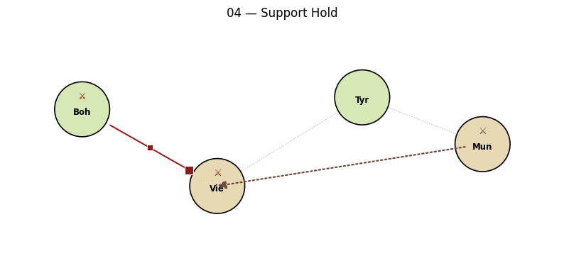

<details><summary>DDL source</summary>

```
@dwex
title: 04 — Support Hold
desc:  A hold-support fends off an equal attacker.

map {
  Vie LA 0,0
  Mun LA 2,0
  Tyr L  1,0
  Boh L  -1,0
  Boh -- Vie
  Vie -- Tyr
  Vie -- Mun
  Mun -- Tyr
}

orders {
  Au A Vie hld
  Au A Boh hsup Vie
  Ge A Mun mve Vie !
}
@end

```
</details>

## 05 — Support Move

A move-support tips the balance over an equal defender.

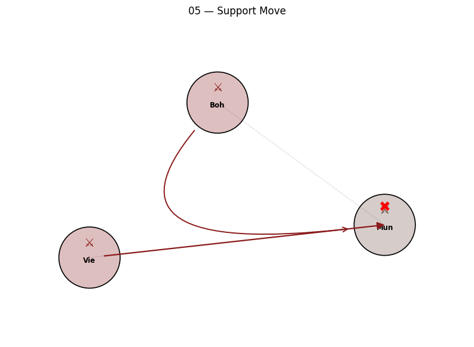

<details><summary>DDL source</summary>

```
@dwex
title: 05 — Support Move
desc:  A move-support tips the balance over an equal defender.

map {
  Vie LA 0,0
  Mun LA 2,0
  Boh L  1,1
  Vie -- Mun
  Boh -- Mun
}

orders {
  Au A Vie mve Mun
  Au A Boh msup Vie
  Ge A Mun hld >
}
@end

```
</details>

## 06 - Support Cut

An attack on the supporter cuts the support; the supported move

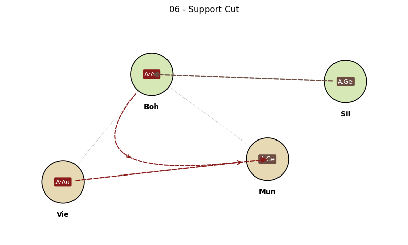

<details><summary>DDL source</summary>

```
@dwex
title: 06 - Support Cut
desc:  An attack on the supporter cuts the support; the supported move
       loses its tie-breaker and bounces.

map {
  Vie LA 0,0
  Mun LA 2,0
  Boh L  1,1
  Sil L  3,1
  Vie -- Mun
  Boh -- Mun
  Boh -- Vie
  Sil -- Boh
}

orders {
  Au A Vie mve Mun !
  Au A Boh msup Vie !
  Ge A Mun hld
  Ge A Sil mve Boh !
}
@end

```
</details>

## 07 - Basic Convoy

Fleet in NTH convoys army from Lon to Bel. Default switch

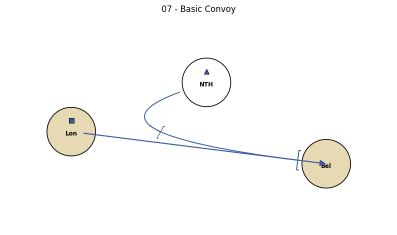

<details><summary>DDL source</summary>

```
@dwex
title: 07 - Basic Convoy
desc:  Fleet in NTH convoys army from Lon to Bel. Default switch
       convoy_routing_engine=always treats any convoy fleet as sufficient.
       Note: the con order's dest is the *starting field* of the convoyed
       unit (Lon), not the army's destination.

map {
  Lon LA  0,0
  NTH W   1,0
  Bel LA  2,0
  Lon --F NTH
  NTH --F Bel
  Lon --C Bel
}

orders {
  En A Lon mve Bel
  En F NTH con Lon
}
@end

```
</details>

## 08 - Convoy Disrupted

An enemy fleet attacks the convoyer with support and dislodges it.

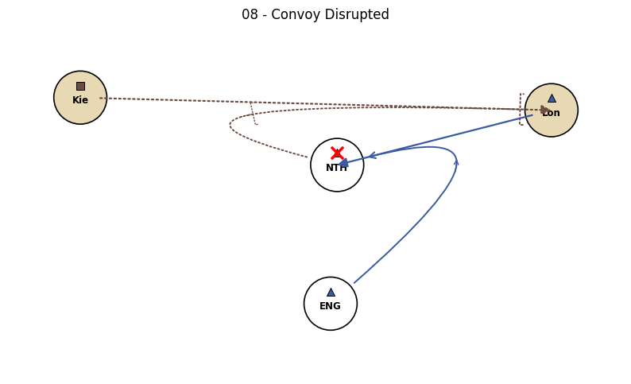

<details><summary>DDL source</summary>

```
@dwex
title: 08 - Convoy Disrupted
desc:  An enemy fleet attacks the convoyer with support and dislodges it.
       The convoy route collapses and the army stays at its origin.
       A Kie's intended move to Lon fails (failed mve becomes hld at start).

map {
  Kie LA 0,0
  Lon LA 4,0
  NTH W  2,0
  CHN W  2,-1
  Kie --F NTH
  NTH --F Lon
  Lon --F NTH
  CHN --F NTH
  CHN --F Lon
  Kie --C Lon
}

orders {
  En F Lon mve NTH
  En F CHN msup Lon
  Ge F NTH con Kie >
  Ge A Kie mve Lon !
}
@end

```
</details>

## 09 - Chain of Three

Three armies form a circular move A->B->C->A. The k4 phase

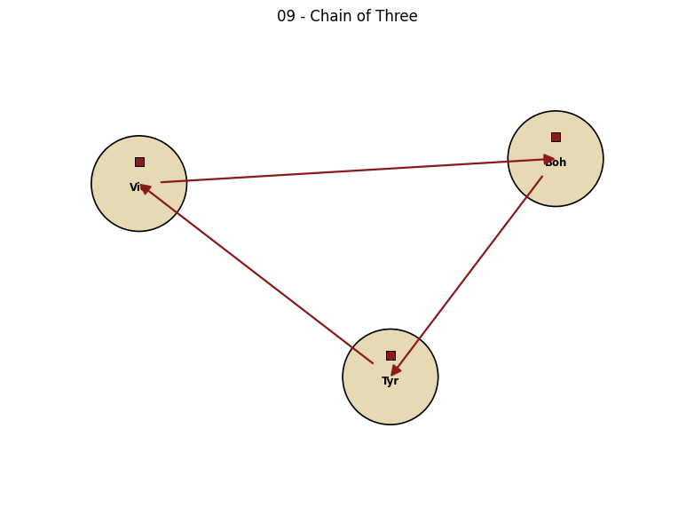

<details><summary>DDL source</summary>

```
@dwex
title: 09 - Chain of Three
desc:  Three armies form a circular move A->B->C->A. The k4 phase
       recognises the cycle and all three moves succeed simultaneously.

map {
  Vie LA 0,0
  Boh LA 2,0
  Tyr LA 1,-1
  Vie -- Boh
  Boh -- Tyr
  Tyr -- Vie
}

orders {
  Au A Vie mve Boh
  Au A Boh mve Tyr
  Au A Tyr mve Vie
}
@end

```
</details>

## 10 - Dislodgement

A unit that issues an order other than hold can still be dislodged.

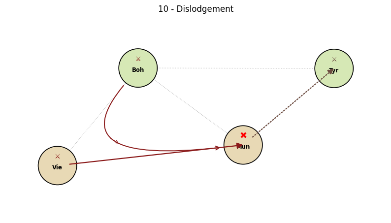

<details><summary>DDL source</summary>

```
@dwex
title: 10 - Dislodgement
desc:  A unit that issues an order other than hold can still be dislodged.
       Mun attempts an equal-strength move to Tyr and bounces; meanwhile
       Vie attacks Mun with msup and dislodges it from behind.

map {
  Vie LA 0,0
  Mun LA 2,0
  Boh L  1,1
  Tyr L  3,1
  Vie -- Mun
  Boh -- Vie
  Boh -- Mun
  Mun -- Tyr
  Tyr -- Boh
}

orders {
  Au A Vie mve Mun
  Au A Boh msup Vie
  Ge A Mun mve Tyr !>
  Ge A Tyr hld
}
@end

```
</details>

## 11 - Pattfield

Three armies of equal strength attack the same empty field.

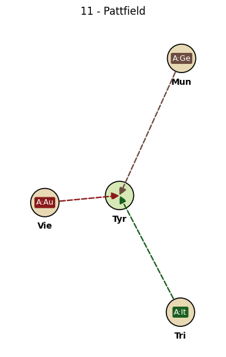

<details><summary>DDL source</summary>

```
@dwex
title: 11 - Pattfield
desc:  Three armies of equal strength attack the same empty field.
       All bounce, the field remains empty, and the engine marks it
       as a pattfield - unavailable for retreats this turn.

map {
  Vie LA 0,0
  Mun LA 2,2
  Tri LA 2,-2
  Tyr L  1,0
  Vie -- Tyr
  Mun -- Tyr
  Tri -- Tyr
}

orders {
  Au A Vie mve Tyr !
  Ge A Mun mve Tyr !
  It A Tri mve Tyr !
}

pattfields {
  Tyr
}
@end

```
</details>

## 12 - Subfield Resolution

The conflict engine operates on superfields only. F Spa moves

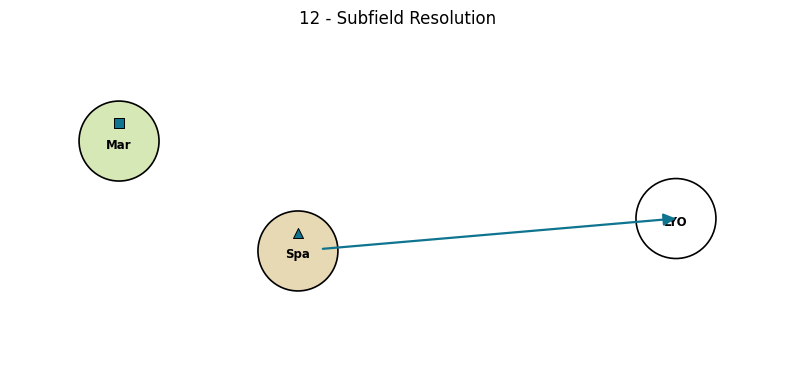

<details><summary>DDL source</summary>

```
@dwex
title: 12 - Subfield Resolution
desc:  The conflict engine operates on superfields only. F Spa moves
       to LYO as a single, atomic step; subfield bookkeeping (SpN vs.
       SpS) belongs to the earlier geography phase. Here Spa is the
       coastal superfield and LYO the adjacent sea.

map {
  Spa LA 0,0
  LYO W  2,0
  Mar L  -1,0
  Spa --F LYO
  Spa -- Mar
}

orders {
  Fr F Spa mve LYO
  Fr A Mar hld
}
@end

```
</details>

## 13 - Invalid mve is NOT hold-supportable (B.4.2.9)

Vie has an invalid mve (to non-existent ZZZ); even with hsup from Bud,

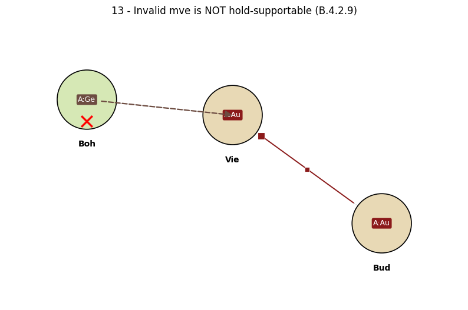

<details><summary>DDL source</summary>

```
@dwex
title: 13 - Invalid mve is NOT hold-supportable (B.4.2.9)
desc:  Vie has an invalid mve (to non-existent ZZZ); even with hsup from Bud,
       Vie is dislodged by Boh's attack - invalid-mve order doesn't let the
       unit be hold-supported.

map {
  Vie LA 0,0
  Bud LA 1,-1
  Boh L  -1,0
  Vie -- Bud
  Vie -- Boh
}

orders {
  Au A Vie mve ZZZ
  Au A Bud hsup Vie
  Ge A Boh mve Vie >
}
@end

```
</details>

## 14 - Invalid sup makes unit hold AND hold-supportable (B.4.2.10)

Vie's hsup target is invalid; Vie reverts to hold (succeeds=False),

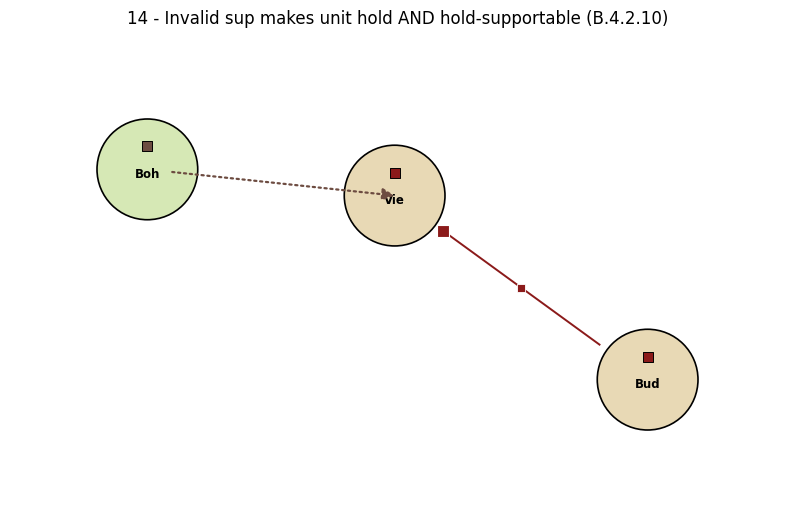

<details><summary>DDL source</summary>

```
@dwex
title: 14 - Invalid sup makes unit hold AND hold-supportable (B.4.2.10)
desc:  Vie's hsup target is invalid; Vie reverts to hold (succeeds=False),
       and Bud's hsup DOES help Vie hold against Boh.

map {
  Vie LA 0,0
  Bud LA 1,-1
  Boh L  -1,0
  Vie -- Bud
  Vie -- Boh
}

orders {
  Au A Vie hsup ZZZ !
  Au A Bud hsup Vie
  Ge A Boh mve Vie !
}

pattfields {
  ZZZ
}
@end

```
</details>
