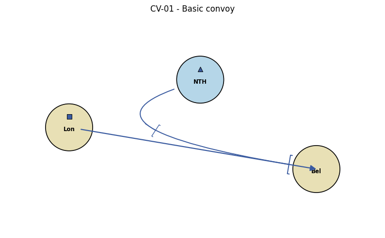
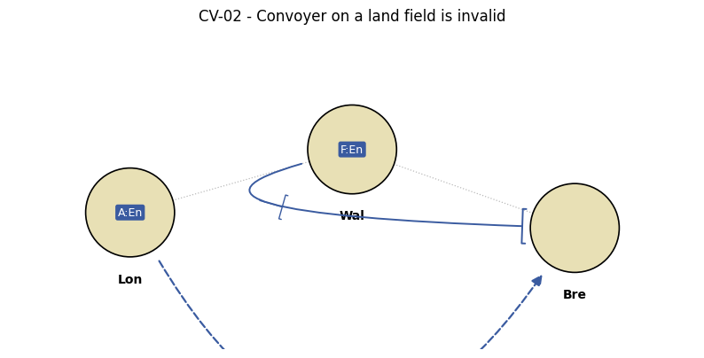
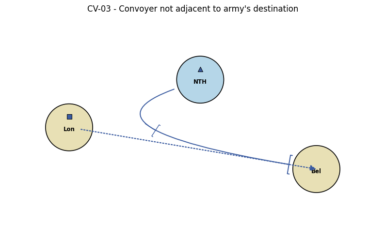
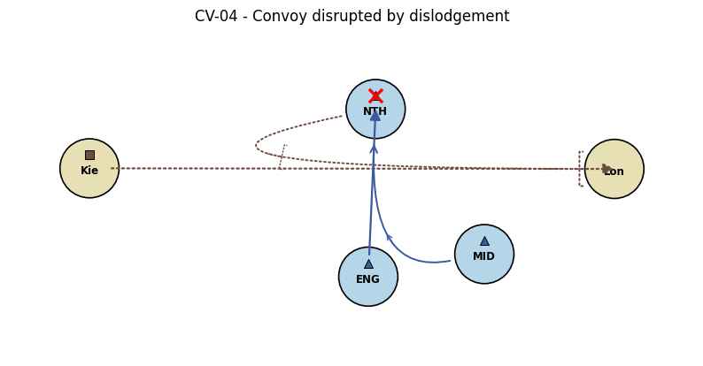
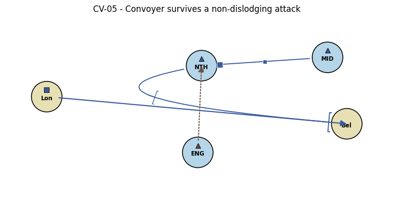
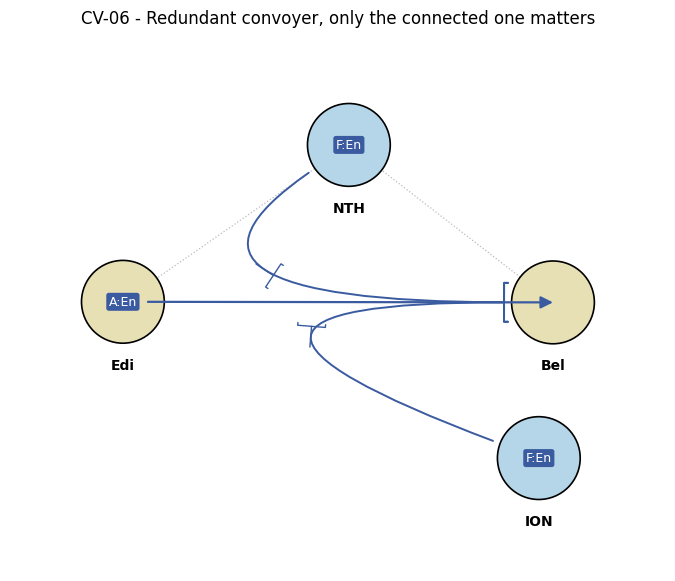
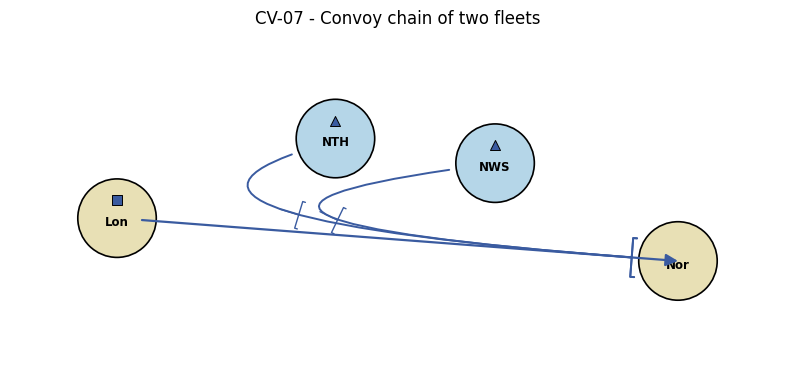
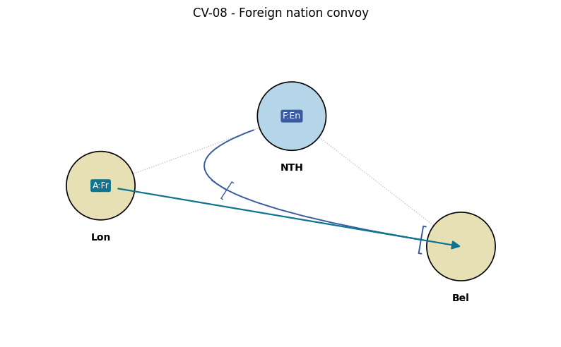

# Convoy Examples

A series of edge cases drawn from the **Gilgamesch-Regeln** (B.3.2.*) and
the R-PBM research items in the comprehensive design spec. Each case has a
stable ID, a one-paragraph description, a rendered diagram, and a matching
test function in [`tests/test_convoy_examples.py`](../tests/test_convoy_examples.py).

Tests run the full pipeline `syntax → geography → conflict` via
`round_full`, so the geography phase actually classifies the orders
(GEO-005/006 for convoy preconditions, GEO-009 for cmove classification)
and the conflict resolver uses the resulting `ConvoyGraph` in `eval_k1`.

| ID    | Title                                       | Status | Source rule |
|-------|---------------------------------------------|--------|-------------|
| CV-01 | Basic convoy                                | ✅      | Gilgamesch B.3.2.1 |
| CV-02 | Convoyer on a land field is invalid         | ✅      | Gilgamesch B.3.2.1 / GEO-005 |
| CV-03 | Convoyer not adjacent to dest               | ✅      | GEO-006 |
| CV-04 | Convoy disrupted by dislodgement            | ✅      | Gilgamesch B.3.2.12 |
| CV-05 | Convoyer survives a non-dislodging attack   | ⚠ xfail | Gilgamesch B.3.2.12 (contrapositive) — known engine limitation |
| CV-06 | Redundant disconnected convoyer is ignored  | ✅      | derived from B.3.2 graph semantics |
| CV-07 | Convoy chain of two fleets                  | ✅      | Gilgamesch B.3.2 ("paarweise benachbarte Wasserfelder") |
| CV-08 | Foreign nation convoy                       | ✅      | Gilgamesch B.3.2.10 |

---

## CV-01 — Basic convoy

An army crosses a single sea field via one fleet. The simplest case; the
convoyer's `con` order names the army's starting field (Gilgamesch
B.3.2.1; DipworkPy notation convention).

[`CV-01_basic.dwex`](examples/convoy/CV-01_basic.dwex) — `test_CV01_basic_convoy_succeeds`

---

## CV-02 — Convoyer on a land field is invalid

Gilgamesch B.3.2.1: the convoyer must be a fleet on a water field. Here
the would-be convoyer (Wal) is a coastal **land** field. Geography phase
rejects the `con` order under GEO-005 (effective_behavior =
`holds_supportable`), the army's cmove route cannot complete, and the
army stays in Lon. The Wal unit holds (Gilgamesch B.4.2.10).

[`CV-02_convoyer_on_land.dwex`](examples/convoy/CV-02_convoyer_on_land.dwex) — `test_CV02_convoyer_on_land_rejected_by_geography`

---

## CV-03 — Convoyer not adjacent to army's destination

The fleet sits on a sea field, but its neighbours don't include the
army's intended destination. Geography phase rejects under GEO-006
(convoyer not adjacent to both army start and dest); the army's cmove
fails because no valid route exists.

[`CV-03_convoyer_not_adjacent.dwex`](examples/convoy/CV-03_convoyer_not_adjacent.dwex) — `test_CV03_convoyer_not_adjacent_rejected_by_geography`

---

## CV-04 — Convoy disrupted by dislodgement

Gilgamesch B.3.2.12: a convoy whose fleet is dislodged during the turn
collapses. F NTH is attacked by F ENG with a supporting F MID; the
support gives ENG enough strength to throw NTH out. With no surviving
route the army stays at its origin.

[`CV-04_disrupted_by_dislodgement.dwex`](examples/convoy/CV-04_disrupted_by_dislodgement.dwex) — `test_CV04_dislodged_convoyer_breaks_chain`

---

## CV-05 — Convoyer survives a non-dislodging attack (KNOWN LIMITATION)

⚠ **The test for this case is marked `xfail`.**

Gilgamesch B.3.2.12 only dissolves the convoy if the fleet is actually
dislodged. Here ENG attacks NTH unsupported (strength 1), but NTH
receives hold-support from MID (legal because a `con` order is not a
movement order, Gilgamesch B.3.1.2). The intended outcome: NTH defends
with effective strength 2, ENG bounces, the convoy chain stays intact,
the army arrives.

**Current engine behaviour:** `eval_k1`'s convoy-attacker dislodgement
loop does not run the actual strength comparison. Any `nmove` targeting
a `fcategory=1` convoyer is treated as if it succeeded, dislodging the
convoyer regardless of defensive strength or hold support. Fixing this
requires the conflict at the convoyer's field to be resolved properly —
a small restructure of `eval_k1.k1_evaluation` where the conflict is
evaluated at the convoyer (`ffield = NTH`) rather than the attacker
(`ffield = ENG`). The diagram below shows the INTENDED outcome.

[`CV-05_survives_bounce.dwex`](examples/convoy/CV-05_survives_bounce.dwex) — `test_CV05_convoy_survives_equal_attack` (xfail)

---

## CV-06 — Redundant disconnected convoyer is ignored

When several fleets carry `con` orders for the same army but only one
of them is geographically wired into a viable chain, the conflict
resolver should use the connected one. The disconnected extra convoyer
(ION) doesn't help and doesn't hurt; it just holds in place.

[`CV-06_redundant_convoyer.dwex`](examples/convoy/CV-06_redundant_convoyer.dwex) — `test_CV06_disconnected_extra_convoyer_is_ignored`

---

## CV-07 — Convoy chain of two fleets

Two fleets relay an army across two sea fields. Gilgamesch B.3.2 phrases
this as *"alle pairwise benachbarten Wasserfelder"* — pairwise sea
adjacency is sufficient to form a valid chain.

[`CV-07_chain_of_two.dwex`](examples/convoy/CV-07_chain_of_two.dwex) — `test_CV07_two_fleet_relay_chain`

---

## CV-08 — Foreign nation convoy

Gilgamesch B.3.2.10 explicitly allows fleets of one nation to convoy a
foreign army. Here England's North-Sea fleet ferries a French army from
London to Belgium. The convoy itself is nation-neutral; only the army's
own move credit goes to France.

[`CV-08_foreign_nation.dwex`](examples/convoy/CV-08_foreign_nation.dwex) — `test_CV08_english_convoys_french_army`

---

## Deferred — not yet covered

- **GEO-010 explicit `[Convoy]` flag** (Gilgamesch B.3.2.14): the
  distinction between "army moves to an adjacent field with `[Convoy]`
  → stays if convoy fails" and "army moves to an adjacent field without
  `[Convoy]` → walks directly, convoy ignored". The engine implements
  this via `Order.via_convoy` (pinned in `tests/test_conflict_datc.py`,
  B.3.2.14 tests); a dedicated CV-NN example entry is still missing.
- **R-PBM-1 PBM-specific convoy nuances** (Schröpl / Kautzsch zines):
  the comprehensive design spec lists this as a research task. Once
  primary sources are consulted and edge cases extracted, they should
  land here as `CV-NN`-numbered entries.
- **R-PBM-2 geographic support cutting**: orthogonal to convoy
  semantics; would expand the support-side test suite, not this file.
- **Convoy paradoxes (Pandin / Szykman)** — the conflict engine has
  paradox-handling switches but they are not covered by an explicit
  example here.
